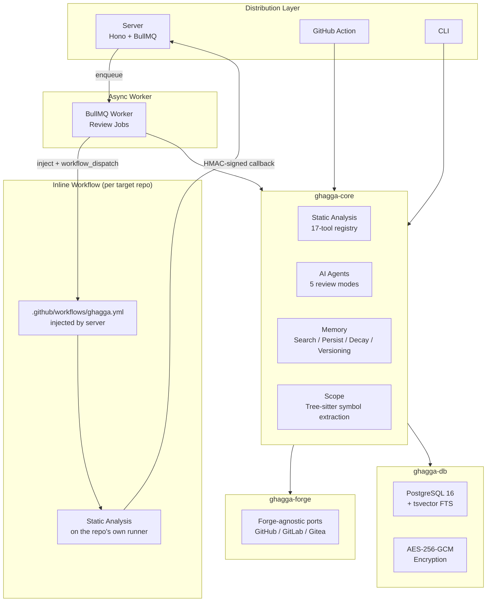
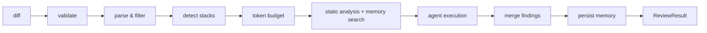
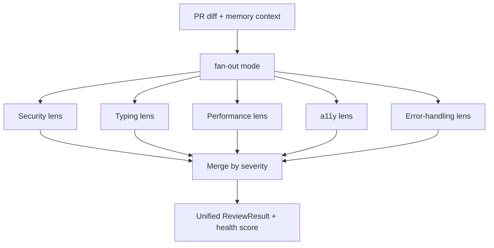

<p align="center">
  
</p>

<h1 align="center">GHAGGA</h1>

<p align="center">
  <strong>Code review con IA que aprende tu proyecto — orquestación multi-agente, 17 herramientas de análisis estático y memoria de reviews persistente.</strong>
</p>

<p align="center">
  <a href="https://www.npmjs.com/package/ghagga"></a>
  <a href="https://github.com/JNZader/ghagga/actions/workflows/ci.yml"></a>
  
  = 20" />
  
</p>

<p align="center">
  <a href="https://ghagga.javierzader.com/"><strong>Sitio web</strong></a> ·
  <a href="https://ghagga.javierzader.com/docs/"><strong>Documentación</strong></a> ·
  <a href="https://ghagga.javierzader.com/app/"><strong>Dashboard en vivo</strong></a> ·
  <a href="https://github.com/apps/ghagga-review/installations/new"><strong>Instalar GitHub App</strong></a>
</p>

Read this in: [English](README.md) · [Español](README.es.md)

---

GHAGGA es un sistema de code review con IA listo para producción — no un wrapper de prompts. Un solo motor de review, cuatro superficies de entrega: una **GitHub App** hosteada, una **GitHub Action**, una **CLI** para review local antes del push y un despliegue **self-hosted** completo con Docker.

Lo que lo hace distinto:

- **El análisis estático corre primero.** 17 herramientas deterministas (Semgrep, Trivy, Gitleaks, Ruff, clippy, …) detectan problemas conocidos antes de gastar un solo token de LLM. Los hallazgos se inyectan en el prompt del review para que el modelo dedique su atención a la lógica y la arquitectura, no al lint.
- **Recuerda.** Decisiones, bugfixes y patrones del pasado persisten entre reviews (PostgreSQL, SQLite o [Engram](https://github.com/Gentleman-Programming/engram)) y se realimentan hacia los siguientes — con búsqueda full-text, decaimiento de fuerza (strength decay) y limpieza de datos sensibles.
- **Cinco estrategias de orquestación.** Desde una única pasada rápida hasta la votación por consenso multi-agente, elegida por review según el tradeoff costo/confianza que quieras.
- **Núcleo forge-agnóstico.** El motor de review habla mediante ports neutrales al proveedor; la CLI publica los hallazgos de vuelta en **pull requests de GitHub** (`--pr`) y **merge requests de GitLab** (`--mr`), con Gitea modelado en la misma abstracción.
- **Sin infraestructura de runners.** El modo server inyecta un workflow inline de GitHub Actions en cada repo objetivo y lo dispara — el análisis pesado corre sobre los minutos de CI gratuitos del propio repo, asegurado con secrets HMAC por despacho.

## En números

| | |
|---|---|
| **Código de producción** | ~62.000 líneas de TypeScript estricto en 8 workspaces |
| **Código de tests** | ~73.000 líneas — *más código de tests que de producción* |
| **Suite de tests** | 4.500+ casos de test en 231 archivos (Vitest), más mutation testing con Stryker |
| **Análisis estático** | 17 herramientas — 7 siempre activas, 10 autodetectadas por stack |
| **Modos de review** | 5 estrategias de orquestación (una pasada → consenso multi-agente) |
| **Distribución** | GitHub App (SaaS) · GitHub Action · CLI de npm · self-hosted con Docker |

## Arquitectura

Un núcleo reutilizable es dueño del pipeline de review; adaptadores finos traducen el transporte y la IO. `ghagga-core` no sabe nada de HTTP, de la auth del dashboard ni del render en terminal, y `ghagga-forge` evita que sepa si está hablando con GitHub, GitLab o Gitea.



Todos los reviews siguen el mismo pipeline, sin importar el punto de entrada:



El pipeline degrada con elegancia: herramientas ausentes, memoria inalcanzable o un LLM sin configurar nunca hacen fallar un review de forma dura.

## Arranque rápido

**GitHub App (hosteada)** — instalá la [App](https://github.com/apps/ghagga-review/installations/new), configurá tu cadena de proveedores en el [dashboard](https://ghagga.javierzader.com/app/) y abrí un PR.

**GitHub Action:**

```yaml
# .github/workflows/ghagga.yml
name: Code Review
on:
  pull_request:
    types: [opened, synchronize, reopened]
permissions:
  pull-requests: write
jobs:
  review:
    runs-on: ubuntu-latest
    steps:
      - uses: actions/checkout@v4
      - uses: JNZader/ghagga@v3
```

**CLI** — revisá tus cambios locales antes de que lleguen a CI:

```bash
npm install -g ghagga
ghagga login                    # autenticarse con GitHub (modelos de IA gratuitos)
ghagga review --staged          # revisar cambios en staging
ghagga review --mode consensus  # voto multi-agente
ghagga review --pr 42           # revisar un PR de GitHub y publicar los hallazgos
ghagga review --mr 42           # revisar un merge request de GitLab y publicar los hallazgos
ghagga health --top 10          # score de salud del proyecto
ghagga hooks install            # hooks de pre-commit + commit-msg
```

**Self-hosted** — stack completo con server, worker, PostgreSQL y Redis:

```bash
git clone https://github.com/JNZader/ghagga.git
cd ghagga
cp .env.example .env
docker compose up -d
```

Guías completas de setup: [Quick Start](https://ghagga.javierzader.com/docs/quick-start) · [GitHub Action](https://ghagga.javierzader.com/docs/github-action) · [CLI](https://ghagga.javierzader.com/docs/cli) · [Configuration](https://ghagga.javierzader.com/docs/configuration)

## Modos de review

Cinco estrategias con tradeoffs de costo/confianza explícitos:

| Modo | Cómo funciona | Costo en tokens | Ideal para |
|------|---------------|:---:|------------|
| `simple` | Una sola pasada de LLM | ~1x | PRs chicos, feedback rápido |
| `consensus` | 3 posturas (advocate / critic / observer) + voto algorítmico | ~3x | Decisiones de aprobación de alta confianza |
| `fan-out` | 5 lentes independientes (seguridad, tipado, performance, a11y, manejo de errores) fusionadas por severidad | ~5x | Cobertura amplia por categoría, lentes propias |
| `workflow` | 5 especialistas en paralelo + paso de síntesis | ~6x | Reviews minuciosos multi-ángulo |
| `diagnostic` | Análisis guiado por hipótesis con follow-ups adaptativos | varía | Escarbar en cambios sospechosos |

`fan-out` es el caballo de batalla multi-agente: lentes independientes revisan el mismo diff en paralelo y después los hallazgos se fusionan por severidad en un único resultado. Podés aportar lentes propias con `--lenses` y `--lens-dir`.



## Análisis estático — Capa 0

Los chequeos deterministas corren antes de la capa estocástica cara. Todas las herramientas son opcionales y se omiten con elegancia cuando faltan.

- **Siempre activas (7):** Semgrep, Trivy, Gitleaks, ShellCheck, CPD, markdownlint, Lizard
- **Autodetectadas por stack (10):** Ruff + Bandit (Python), golangci-lint (Go), Biome (JS/TS), clippy (Rust), PMD (Java), Psalm (PHP), Hadolint (Docker), zizmor (GitHub Actions), SonarQube (vía MCP)

La GitHub Action empaqueta las 16 herramientas que corren directamente sobre el runner; SonarQube está disponible en modo server sobre MCP, para un total de 17 en el registro completo.

En modo server, esta capa corre como un **workflow inline inyectado en el repo objetivo** — sin repo de runner aparte que aprovisionar, sin análisis hambriento de RAM en el server de la API. Los callbacks se verifican con secrets HMAC-SHA256 por despacho bajo un TTL.

## Memoria de proyecto

La parte que hace que los reviews se acumulen con el tiempo:

- **Buscar antes del review** — las observaciones pasadas relevantes se inyectan como contexto en los prompts.
- **Persistir después del review** — los hallazgos significativos se guardan como observaciones tipadas (`decision`, `pattern`, `bugfix`, `architecture`, …) con deduplicación.
- **Decaimiento de fuerza** — las observaciones viejas se desvanecen del contexto en vez de contaminarlo para siempre.
- **Versionado** — branch / snapshot / merge / rollback estilo git sobre el estado de la memoria.
- **Limpieza de datos sensibles** — 16 patrones de redacción (API keys, tokens de proveedores, JWTs, claves PEM/SSH, secrets de entorno, credenciales embebidas en URLs) corren antes de cualquier escritura.

Backends: PostgreSQL (`tsvector` + `ts_rank`) para modo server, SQLite (FTS5 + BM25) para CLI/Action, o Engram sobre HTTP.

## Seguridad

| Control | Implementación |
|---------|----------------|
| API keys de proveedores | Cifrado AES-256-GCM en reposo, claves por instalación |
| Webhooks de GitHub | HMAC-SHA256 con comparación de tiempo constante |
| Callbacks del runner | Secrets HMAC derivados por despacho + TTL con timestamp embebido |
| Escrituras de memoria | Limpieza de datos sensibles (16 patrones de redacción) |
| URLs de gateway salientes | Guarda anti-SSRF — validación de rango de IP + DNS al persistir, revalidada en ejecución |
| Prompts de LLM | Frontera de confianza — contenido del repo, memoria y hallazgos previos enmarcados y saneados como entrada no confiable |
| Cola de jobs | Las credenciales nunca entran a los payloads de Redis — los workers re-obtienen las claves cifradas desde PostgreSQL |
| Workflow inyectado | `permissions: contents: read`, enmascarado de secrets, normalización de salidas |
| Cobertura de tests | Suite de seguridad dedicada: detección de manipulación en el cifrado, correctitud de HMAC, no-logging de secrets, no-eval, chequeos de prototype pollution |

Reportes de vulnerabilidades: ver [SECURITY.md](SECURITY.md).

## Monorepo

```text
ghagga/
├── packages/
│   ├── core/        # Review engine: agents, 17-tool registry, memory, tree-sitter scoping
│   ├── db/          # Drizzle schema, PostgreSQL queries, AES-256-GCM crypto, migrations
│   ├── forge/       # Forge-agnostic ports & domain types (GitHub / GitLab / Gitea)
│   └── types/       # Shared API contracts
├── apps/
│   ├── server/      # Hono API + BullMQ workers + GitHub App integration
│   ├── action/      # GitHub Action runtime (SQLite memory via @actions/cache)
│   ├── cli/         # npm CLI: review, memory, hooks, health, audit, feedback
│   └── dashboard/   # React 19 SPA: provider chains, review history, memory browser
├── templates/       # Inline static-analysis workflow template
└── docs/            # Documentation site (GitHub Pages)
```

Paquetes publicados: `ghagga` (CLI), `ghagga-core`, `ghagga-db` y `ghagga-forge`.

**Stack:** TypeScript (strict) · Hono · BullMQ + Redis · PostgreSQL 16 + Drizzle · React 19 + Vite + Tailwind 4 · Vitest + Stryker · Biome · pnpm + Turborepo

**Proveedores de LLM:** todo se rutea a través de una cadena de proveedores con fallback ordenado — `gateway` (cualquier modelo vía [mcp-llm-bridge](https://github.com/JNZader/mcp-llm-bridge)), `cli-bridge` (CLIs locales de Claude / Gemini / Copilot) u `ollama` (modelos locales).

## Notas de ingeniería

Algunas decisiones que vale la pena mencionar:

- **División núcleo/adaptador.** El motor de review es agnóstico al transporte y al forge; server, Action y CLI son traductores finos de IO. Agregar una superficie de entrega no toca el pipeline.
- **Los tests pesan más que el código de producción** (~73k vs ~62k LOC), con mutation testing (Stryker) protegiendo core, server y Action de tests sin aserciones.
- **v2 fue una reescritura real**, no un parche: la dispersión Deno + Node + Python de v1 colapsó en un monorepo de un solo runtime en Node, con orquestación asincrónica (BullMQ), un registro de 17 herramientas (antes solo Semgrep) y un sistema de memoria realmente usado.
- **Degradación elegante en todos lados.** Herramientas estáticas ausentes, backends de memoria inalcanzables, inyección de workflow bloqueada — cada capa hace fallback en vez de tumbar el review.

## Desarrollo

```bash
pnpm install
docker compose up postgres redis -d
cp .env.example .env
pnpm --filter ghagga-db db:push
pnpm exec turbo typecheck build test
```

Los análisis en profundidad viven en el [sitio de documentación](https://ghagga.javierzader.com/docs/): [Architecture](https://ghagga.javierzader.com/docs/architecture) · [Memory System](https://ghagga.javierzader.com/docs/memory-system) · [API Reference](https://ghagga.javierzader.com/docs/api-reference) · [Database Schema](https://ghagga.javierzader.com/docs/database-schema)

## Contribuir

Las contribuciones son bienvenidas. Empezá por [CONTRIBUTING.md](CONTRIBUTING.md) y el [Código de Conducta](CODE_OF_CONDUCT.md). Los temas de seguridad van por [SECURITY.md](SECURITY.md), no por issues públicos.

## Créditos

Inspirado en [Gentleman Guardian Angel (GGA)](https://github.com/Gentleman-Programming/gentleman-guardian-angel) y [Engram](https://github.com/Gentleman-Programming/engram) de [Gentleman Programming](https://youtube.com/@GentlemanProgramming).

## Licencia

MIT. Ver [LICENSE](LICENSE).
