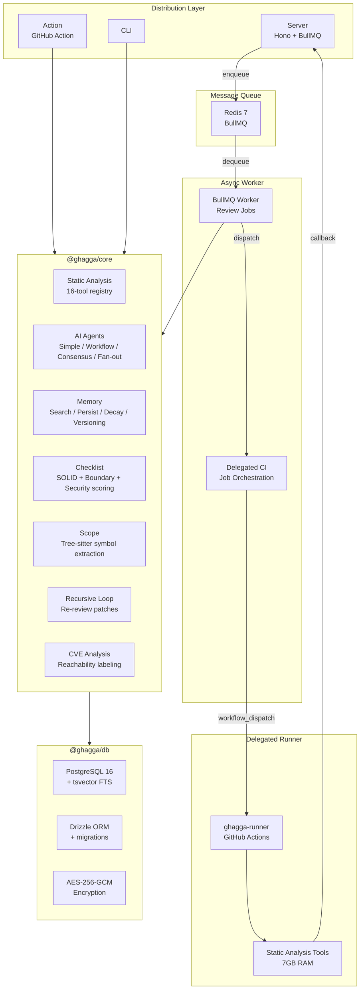
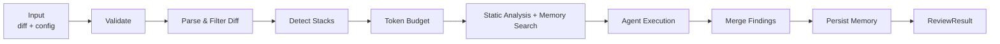

<p align="center">
  
</p>

<h1 align="center">GHAGGA</h1>

<p align="center">
  <strong>AI code review for pull requests and local changes, backed by static analysis, project memory, and delegated CI.</strong>
</p>

<p align="center">
  
  
  
  
</p>

<p align="center">
  <a href="https://ghagga.javierzader.com/"><strong>Website</strong></a> ·
  <a href="https://ghagga.javierzader.com/docs/"><strong>Documentation</strong></a> ·
  <a href="https://ghagga.javierzader.com/app/"><strong>Dashboard</strong></a> ·
  <a href="https://github.com/apps/ghagga-review/installations/new"><strong>GitHub App</strong></a>
</p>

## Quick Portfolio Snapshot

GHAGGA is a production-oriented AI review system, not just a prompt wrapper.

- It reviews pull requests through a GitHub App, a GitHub Action, a CLI, or a full self-hosted server.
- It combines LLM review with up to 16 static analysis tools so known issues are caught before tokens are spent.
- It persists project memory across reviews using PostgreSQL, SQLite, or Engram-compatible backends.
- It supports multiple review orchestration strategies: single-pass, specialist workflow, consensus voting, and fan-out lenses.
- It includes delegated CI orchestration so safe lint and test jobs can run on user-owned runner infrastructure.
- It was built as a full TypeScript monorepo with a real server, worker, dashboard, CLI, crypto layer, queueing, and testing story.

Visuals coming soon: live review screenshots and dashboard walkthrough.

## Why It Matters

- **For maintainers**: turns PR review into a repeatable pipeline instead of ad hoc comments.
- **For teams**: preserves prior decisions, patterns, bugfixes, and architecture context as searchable memory.
- **For local development**: lets developers review staged or unstaged changes before pushing.
- **For self-hosters**: supports a full Docker deployment with PostgreSQL, Redis, BullMQ, dashboard auth, and encrypted provider settings.
- **For security-minded users**: layers static analysis, HMAC verification, AES-256-GCM encryption, privacy stripping, and delegated execution boundaries.

## Quick Start

### GitHub App (SaaS)

1. Install the [GHAGGA GitHub App](https://github.com/apps/ghagga-review/installations/new).
2. Open the [Dashboard](https://ghagga.javierzader.com/app/).
3. Configure your provider chain.
4. Open a PR and receive a review comment.

### GitHub Action

```yaml
# .github/workflows/ghagga.yml
name: Code Review

on:
  pull_request:
    types: [opened, synchronize, reopened]

permissions:
  pull-requests: write

jobs:
  review:
    runs-on: ubuntu-latest
    steps:
      - uses: actions/checkout@v4
      - uses: JNZader/ghagga-action@v1
```

### CLI

```bash
npm install -g ghagga
ghagga login
ghagga review
ghagga health
ghagga memory list
```

### Self-Hosted

```bash
git clone https://github.com/JNZader/ghagga.git
cd ghagga
cp .env.example .env
docker compose up -d
```

## Jump To Technical Docs

- [Technical README](#technical-readme)
- [Architecture](#architecture)
- [Review Modes](#review-modes)
- [Memory System](#memory-system)
- [Configuration](#configuration)

---

<a id="technical-readme"></a>

## Technical README

## Table of Contents

- [What Is This?](#what-is-this)
- [Distribution Modes](#distribution-modes)
- [GitHub App SaaS](#github-app-saas)
- [GitHub Action](#github-action)
- [CLI](#cli)
- [Self-Hosted](#self-hosted)
- [Architecture](#architecture)
- [Review Pipeline](#review-pipeline)
- [Review Modes](#review-modes)
- [Static Analysis](#static-analysis)
- [Runner Architecture](#runner-architecture)
- [Delegated CI](#delegated-ci)
- [Memory System](#memory-system)
- [Security](#security)
- [Monorepo Structure](#monorepo-structure)
- [Configuration](#configuration)
- [Development](#development)
- [Testing](#testing)
- [Tech Stack](#tech-stack)
- [v1 vs v2](#v1-vs-v2)
- [License](#license)

---

## What Is This?

GHAGGA is an AI-assisted code review platform that applies the same core pipeline across PR reviews, local CLI reviews, and self-hosted automation.

Every review follows the same high-level flow:

1. Receive a diff from GitHub or local git state.
2. Run static analysis first when available.
3. Search project memory for past decisions, bugfixes, patterns, and discoveries.
4. Execute the selected review mode.
5. Merge and format findings.
6. Persist significant observations back into memory.

### Key Capabilities

| Capability | What it means |
|------------|---------------|
| **4 review modes** | `simple`, `workflow`, `consensus`, `fan-out` |
| **16 static analysis tools** | Always-on and auto-detected tools that cost zero LLM tokens |
| **Project memory** | PostgreSQL, SQLite, or Engram-backed observation storage and retrieval |
| **Delegated CI** | Safe lint and test execution on user-owned runner infrastructure |
| **Multiple delivery modes** | GitHub App, GitHub Action, CLI, or full self-hosted deployment |
| **Security controls** | AES-256-GCM encryption, HMAC callbacks, privacy stripping, execution boundaries |

---

## Distribution Modes

| Mode | Primary use | Static analysis | Memory |
|------|-------------|-----------------|--------|
| **GitHub App** | Hosted PR reviews via dashboard configuration | Via delegated runner when enabled | PostgreSQL |
| **GitHub Action** | Per-repo CI workflow | Direct on the Actions runner | SQLite + `@actions/cache` |
| **CLI** | Local review before commit/push | Direct if tools are installed locally | SQLite or Engram |
| **Self-hosted server** | Full control over infra and secrets | Via delegated runner | PostgreSQL |

---

## GitHub App SaaS

The hosted GitHub App is the fastest path for teams that want PR review without maintaining infrastructure.

### What it does

- Receives `pull_request` webhooks.
- Uses dashboard-configured settings and provider chain.
- Optionally dispatches static analysis to a `ghagga-runner` repository.
- Posts structured review comments back to the PR.
- Stores review history and project memory in PostgreSQL.

### Required GitHub permissions

| Permission | Access | Why |
|------------|--------|-----|
| **Pull requests** | Read and write | Fetch diffs and post comments |
| **Actions** | Write | Dispatch runner workflows |
| **Secrets** | Read and write | Store encrypted provider credentials |
| **Metadata** | Read-only | Enumerate repos and installations |

### Important auth note

In server/SaaS mode, GitHub Models requires a PAT with `models:read`. GitHub App installation tokens do not include that scope, so a GitHub Models entry without an explicit PAT is skipped at review time.

---

## GitHub Action

The GitHub Action runs GHAGGA directly inside your repository workflow. It is the most self-contained PR integration: checkout, analyze, fetch diff, review, comment.

### Minimal workflow

```yaml
name: Code Review

on:
  pull_request:
    types: [opened, synchronize, reopened]

permissions:
  pull-requests: write

jobs:
  review:
    runs-on: ubuntu-latest
    steps:
      - uses: actions/checkout@v4
      - uses: JNZader/ghagga-action@v1
```

### Action inputs

These are taken from `action.yml`.

| Input | Required | Default | Description |
|-------|----------|---------|-------------|
| `provider` | No | `gateway` | Provider mode: `gateway`, `cli-bridge`, or `ollama`. Legacy values such as `github`, `anthropic`, `openai`, `google`, `qwen`, `groq`, `cerebras`, `deepseek`, and `openrouter` are auto-remapped to `gateway`. |
| `model` | No | Auto | Model identifier. `auto` is valid for `gateway` and `cli-bridge`. |
| `mode` | No | `simple` | Review mode: `simple`, `workflow`, `consensus` |
| `api-key` | No | None | Provider credential. Optional for `gateway`, optional for `cli-bridge`, not required for `ollama`. |
| `github-token` | No | `${{ github.token }}` | Used for diff fetching and PR comments. |
| `enabled-tools` | No | Empty | Comma-separated tools to force-enable. |
| `disabled-tools` | No | Empty | Comma-separated tools to force-disable. |
| `enable-semgrep` | No | `true` | Deprecated compatibility flag. |
| `enable-trivy` | No | `true` | Deprecated compatibility flag. |
| `enable-cpd` | No | `true` | Deprecated compatibility flag. |
| `enable-memory` | No | `true` | Enables SQLite-backed memory persisted with `@actions/cache`. |

### Action outputs

| Output | Description |
|--------|-------------|
| `status` | `PASSED`, `FAILED`, `NEEDS_HUMAN_REVIEW`, or `SKIPPED` |
| `findings-count` | Total number of findings returned by the review |

### Review status and CI behavior

- When the review returns `FAILED`, the Action calls `core.setFailed()`.
- That means the workflow check fails by default.
- If you want advisory-only behavior, use `continue-on-error: true` on the GHAGGA step.

### Example: advisory mode

```yaml
- uses: JNZader/ghagga-action@v1
  id: review
  continue-on-error: true
```

### Example: inspect the result later in the workflow

```yaml
- uses: JNZader/ghagga-action@v1
  id: review

- name: React to review result
  if: steps.review.outputs.status == 'FAILED'
  run: echo "Review found issues: ${{ steps.review.outputs.findings-count }}"
```

---

## CLI

The CLI is for reviewing local changes before they hit CI. It is also the richest operational surface in the project: login flow, review pipeline, memory inspection, git hooks, health checks, audit, feedback, and dismissal management.

### Quick examples

```bash
ghagga login
ghagga review
ghagga review --mode workflow --verbose
ghagga review --quick
ghagga review --staged --exit-on-issues
ghagga health --top 10
ghagga memory search "error handling"
ghagga hooks install
```

### Core commands

| Command | Purpose |
|---------|---------|
| `ghagga login` | Authenticate with GitHub and persist local config |
| `ghagga logout` | Clear stored credentials |
| `ghagga status` | Show current auth and config |
| `ghagga review [path]` | Review local changes |
| `ghagga health [path]` | Run a project health assessment |
| `ghagga audit [path]` | Run a full-project audit |
| `ghagga memory <subcommand>` | Inspect and manage review memory |
| `ghagga hooks <subcommand>` | Install, uninstall, or inspect git hooks |
| `ghagga dismiss ...` | Suppress a finding in future reviews |
| `ghagga feedback ...` | Record accepted/rejected/modified feedback for improvement rules |

### Review command options

These are taken from `apps/cli/src/index.ts`.

| Option | Short | Default | Description |
|--------|-------|---------|-------------|
| `[path]` |  | `.` | Repository or subdirectory to review |
| `--mode <mode>` | `-m` | `simple` | `simple`, `workflow`, `consensus`, `fan-out` |
| `--provider <provider>` | `-p` | Stored config or `gateway` | `gateway`, `cli-bridge`, `ollama` |
| `--model <model>` |  | Provider default | Model identifier |
| `--api-key <key>` |  | None | API key or gateway token |
| `--output <format>` | `-o` | Markdown | `markdown`, `json`, `sarif` |
| `--format <format>` | `-f` | Deprecated | Deprecated alias for `--output` |
| `--disable-tool <name>` |  | Empty | Repeatable tool disable flag |
| `--enable-tool <name>` |  | Empty | Repeatable tool enable flag |
| `--list-tools` |  | `false` | Print tool availability and exit |
| `--no-memory` |  | Enabled | Disable memory search and persist |
| `--memory-backend <type>` |  | `sqlite` | `sqlite` or `engram` |
| `--config <path>` | `-c` | `.ghagga.json` | Project config file path |
| `--verbose` | `-v` | `false` | Stream pipeline progress |
| `--staged` |  | `false` | Review only staged changes |
| `--commit-msg <file>` |  | None | Validate commit message file |
| `--exit-on-issues` |  | `false` | Exit 1 on blocking issues |
| `--quick` |  | `false` | Static analysis only, skip AI review |
| `--enhance` |  | `false` | AI post-analysis enhancement |
| `--issue <target>` |  | None | Create `new` or update an issue number with results |
| `--lenses <names>` |  | None | Comma-separated custom lens names for fan-out mode |
| `--lens-dir <path>` |  | `.ghagga/lenses/` | Directory for custom lens definitions |

### Login and auth flow

- `ghagga login` authenticates with GitHub.
- Stored config lives in `~/.config/ghagga/config.json` or `$XDG_CONFIG_HOME/ghagga/config.json`.
- `GITHUB_TOKEN` can be used as fallback auth for `gateway` and `cli-bridge` flows.
- Legacy direct providers are intentionally rejected in the CLI and should be routed through `mcp-llm-bridge` via `--provider gateway`.

### Health command

```bash
ghagga health
ghagga health ./src
ghagga health --top 10
```

The health check computes a score, surfaces top issues, and supports machine-readable output for CI.

### Hook workflow

```bash
ghagga hooks install
ghagga hooks install --pre-commit
ghagga hooks install --commit-msg
ghagga hooks uninstall
ghagga hooks status
```

- `pre-commit` runs `ghagga review --staged --plain --exit-on-issues` and prefers `--quick` behavior for fast feedback.
- `commit-msg` validates commit message quality through `ghagga review --commit-msg <file> --plain --exit-on-issues`.
- Hooks auto-detect `ghagga` in `PATH` and degrade gracefully if it is missing.

### Memory command group

```bash
ghagga memory list
ghagga memory search "error handling"
ghagga memory show 42
ghagga memory stats
ghagga memory delete 42
ghagga memory clear --repo owner/repo
```

### Feedback and dismissal flows

```bash
ghagga dismiss <finding-hash> --category security --reason "false positive"
ghagga dismiss list
ghagga dismiss remove <finding-hash>

ghagga feedback <pr-url> <finding-hash> accepted
ghagga feedback rules
ghagga feedback list --category security
```

- `dismiss` stores negative examples so repeated false positives can be suppressed.
- `feedback` records accepted, rejected, or modified findings and derives future improvement rules once enough samples exist.

### Exit codes

| Code | Meaning |
|------|---------|
| `0` | `PASSED` or `SKIPPED` |
| `1` | `FAILED` or `NEEDS_HUMAN_REVIEW` |

---

## Self-Hosted

The self-hosted deployment is the full-stack version: server, worker, PostgreSQL, Redis, dashboard auth, encrypted settings, and delegated runner support.

### Minimal bootstrap

```bash
git clone https://github.com/JNZader/ghagga.git
cd ghagga
cp .env.example .env
docker compose up -d
```

### Services

| Service | Role |
|---------|------|
| `server` | Hono API server handling webhooks and dashboard API |
| `worker` | BullMQ worker executing async review jobs |
| `postgres` | PostgreSQL 16 for settings, installs, and memory |
| `redis` | Queue backend for BullMQ |

### GitHub App requirements

To self-host the PR-reviewing server you need a GitHub App with:

- Pull requests: read and write
- Actions: write
- Secrets: read and write
- `pull_request` and `issue_comment` event subscriptions if you want comment-triggered reviews

### Security bootstrap

You will need values for:

- `GITHUB_APP_ID`
- `GITHUB_PRIVATE_KEY`
- `GITHUB_WEBHOOK_SECRET`
- `GITHUB_CLIENT_ID`
- `GITHUB_CLIENT_SECRET`
- `ENCRYPTION_KEY`
- `STATE_SECRET`

---

## Architecture



### Core and adapters split

The project is intentionally structured so `@ghagga/core` owns the review engine and knows nothing about HTTP, dashboard auth, or CLI rendering.

| Adapter | Input | Output | Memory | Static analysis |
|---------|-------|--------|--------|-----------------|
| **Server** | GitHub webhook | PR comment via GitHub API | PostgreSQL | Delegated runner |
| **Action** | PR event | PR comment via Octokit | SQLite | Local on Actions runner |
| **CLI** | Local git diff | Terminal output / JSON / SARIF | SQLite or Engram | Local if tools exist |

This is the right pattern. Core owns the pipeline. Adapters only translate transport and IO. Anything else becomes a maintenance swamp.

---

## Review Pipeline



The pipeline degrades gracefully:

- If static analysis tools are unavailable, review continues.
- If memory is unavailable, review continues.
- If no LLM is configured, static-only paths still produce useful output where supported.

---

## Review Modes

GHAGGA supports four review strategies with different cost and confidence tradeoffs.

### Simple

- One LLM call.
- Best for quick reviews and small PRs.
- Lowest token cost.

### Workflow

- Five specialists run in parallel: scope, coding standards, error handling, security, performance.
- One synthesis step merges and deduplicates findings.
- Best for broad, structured review.

### Consensus

- Three parallel stances: advocate, critic, observer.
- Final status is computed algorithmically from weighted votes.
- Best for critical paths and high-confidence decisions.

### Fan-out

- Five constrained lenses run in parallel.
- Findings are merged by file and line, with higher severity winning conflicts.
- Best when you want intentionally separate perspectives like security, typing, performance, accessibility, and error handling.

### Mode comparison

| Mode | How it works | Approx token multiplier | Best for |
|------|---------------|-------------------------|----------|
| **Simple** | Single pass | ~1x | Small PRs, fast feedback |
| **Workflow** | 5 specialists + synthesis | ~6x | Thorough multi-angle reviews |
| **Consensus** | 3 votes + algorithmic resolution | ~3x | High-confidence approval decisions |
| **Fan-out** | 5 independent lenses + merge | ~5x | Broad category coverage |

---

## Static Analysis

Static analysis is Layer 0. That matters because deterministic checks should run before the expensive stochastic layer.

### Tool tiers

- **Always-on (7)**: Semgrep, Trivy, CPD, Gitleaks, ShellCheck, markdownlint, Lizard
- **Auto-detect (9)**: Ruff, Bandit, golangci-lint, Biome, PMD, Psalm, clippy, Hadolint, zizmor

### Behavior

- Tools are optional and skipped gracefully if missing.
- Findings are injected into review prompts so the LLM can focus on logic and architecture instead of rediscovering obvious issues.
- Tool control exists via `enabled-tools`, `disabled-tools`, `--enable-tool`, and `--disable-tool`.

### Custom Semgrep rules

```json
{
  "customRules": [".semgrep/custom-rules.yml"]
}
```

---

## Runner Architecture

The server mode offloads heavy static analysis to a user-owned `ghagga-runner` repository on GitHub Actions.

### Why it exists

Running tools like Semgrep, PMD/CPD, Trivy, and the rest together is RAM-hungry. A tiny server should not pretend it is a CI worker farm.

### Flow

1. Server receives PR webhook.
2. Server checks whether `{owner}/ghagga-runner` exists.
3. If it exists, the server generates a per-dispatch callback secret.
4. The server triggers `workflow_dispatch` with 10 string inputs.
5. The runner installs or restores tools, runs analysis, and posts a signed callback.
6. The server verifies HMAC, merges findings, and posts the final review.

### Dispatch inputs

| Input | Description |
|-------|-------------|
| `callbackId` | UUID for this dispatch |
| `repoFullName` | `owner/repo` being reviewed |
| `prNumber` | Pull request number |
| `headSha` | Head commit SHA |
| `baseBranch` | Base branch |
| `callbackUrl` | Server endpoint for callback |
| `callbackSecret` | Per-dispatch HMAC secret |
| `enabledTools` | Comma-separated tool overrides |
| `disabledTools` | Comma-separated tool overrides |
| `toolRegistryEnabled` | Compatibility flag kept for old runner templates |

### Fallback behavior

If no runner is available, the server continues with LLM-only review instead of hard failing.

---

## Delegated CI

Delegated CI extends the runner idea beyond static analysis. Instead of only running GHAGGA-owned tools, it can run curated safe jobs like lint and tests.

### What it is for

- Zero repo workflow maintenance for basic CI.
- Reuse of the same public runner infrastructure.
- Explicit policy control over which jobs are safe to delegate.

### Supported execution profiles

| Profile | Runtime | Command | Default timeout |
|---------|---------|---------|-----------------|
| `node-lint` | Node.js 20 | `npm run lint` | 5 min |
| `node-unit` | Node.js 20 | `npm test` | 10 min |
| `python-lint` | Python 3.12 | `ruff check .` | 5 min |
| `python-pytest` | Python 3.12 | `pytest` | 10 min |
| `go-test` | Go 1.22 | `go test ./...` | 10 min |

### Policy model

Jobs are repo-scoped and classified as either:

- `safe/delegable`
- `sensitive/no-delegable`

Sensitive jobs are rejected instead of being run on public runner infrastructure. That boundary is a feature, not a limitation.

---

## Memory System

This is one of the parts that makes GHAGGA more than a wrapper around a single prompt. It learns from prior reviews and feeds that context into future ones.

### Storage backends

| Backend | Used by | Search engine |
|---------|---------|---------------|
| **PostgreSQL** | Server / SaaS / self-hosted | `tsvector` + GIN + `ts_rank` |
| **SQLite** | CLI and GitHub Action | FTS5 + BM25 |
| **Engram** | CLI optional backend | Delegated HTTP API |

### Pipeline lifecycle

Memory participates in two stages:

1. **Search before review**
2. **Persist after review**

### Search phase

- `buildSearchQuery()` extracts terms from file paths.
- Noise directories like `src`, `lib`, `dist`, and `test` are stripped.
- Query terms are capped.
- Up to 3 past observations are loaded.
- The result is injected into prompts as `## Past Review Memory`.

### Persist phase

- Only significant findings are stored.
- Privacy stripping runs before any write.
- Sessions and observations are stored separately.
- Deduplication uses a content hash plus a rolling time window.
- PR summaries use topic-key upsert instead of uncontrolled duplication.

### Strength decay

| Phase | Behavior |
|-------|----------|
| **Active** | Full relevance |
| **Decaying** | Linearly decreases toward zero |
| **Cleared** | Excluded from search context |

### Memory versioning

GHAGGA includes git-like memory operations:

- Branch
- Snapshot
- Merge
- Rollback

Merge operations keep contradictory observations instead of inventing a fake resolution.

### Observation types

| Type | Purpose |
|------|---------|
| `decision` | Design and architecture decisions |
| `pattern` | Repeated implementation conventions |
| `bugfix` | Known failure patterns and fixes |
| `learning` | General project knowledge |
| `architecture` | Structural system knowledge |
| `config` | Configuration conventions |
| `discovery` | Important codebase findings |

### Privacy stripping

Before persistence, sensitive content is redacted via 13 regex-based patterns, including:

- Anthropic keys
- OpenAI keys
- AWS access key IDs
- GitHub tokens
- Google API keys
- Slack tokens
- Bearer tokens
- JWTs
- PEM private keys
- Password and secret assignments
- Base64 credential blobs

### Engram integration

```bash
ghagga review --memory-backend engram
export GHAGGA_MEMORY_BACKEND=engram
export GHAGGA_ENGRAM_HOST=http://localhost:7437
export GHAGGA_ENGRAM_TIMEOUT=5
```

If Engram is unreachable, the CLI falls back to SQLite automatically.

---

## Security

| Control | Implementation |
|---------|----------------|
| **API key encryption** | AES-256-GCM with per-installation encryption keys |
| **Webhook verification** | HMAC-SHA256 with constant-time comparison |
| **Runner callback verification** | Per-dispatch HMAC secret with TTL |
| **Privacy stripping** | 13 regex patterns before memory persistence |
| **Timeouts** | LLM and HTTP timeout boundaries |
| **Installation scoping** | Data and routes scoped to GitHub installation or repo context |
| **Correlation IDs** | End-to-end tracing through review execution |

### Runner security model

When private repo code is analyzed through the public runner model, the system relies on multiple layers:

- output suppression
- log masking
- log deletion
- short retention windows

### Automated security coverage

Security-oriented tests validate things like:

- no secret logging
- no hardcoded credentials
- no unsafe `eval` style behavior
- encryption roundtrips and tamper detection
- HMAC verification correctness
- privacy stripping coverage

---

## Monorepo Structure

```text
ghagga/
├── packages/
│   ├── core/        # Review engine, agents, tools, memory, scoping, exploitability
│   ├── db/          # Drizzle schema, queries, crypto, migrations
│   └── types/       # Shared contracts
├── apps/
│   ├── server/      # Hono API + BullMQ workers + GitHub integration
│   ├── dashboard/   # React SPA for settings, stats, reviews, memory
│   ├── cli/         # npm CLI with login, review, memory, hooks, audit
│   └── action/      # GitHub Action runtime
├── templates/       # Runner workflow templates
├── docs/            # Long-form documentation
├── landing/         # Marketing site
└── openspec/        # Spec-driven development artifacts
```

---

## Configuration

### Server environment variables

| Variable | Required | Description |
|----------|----------|-------------|
| `DATABASE_URL` | Yes | PostgreSQL connection string |
| `GITHUB_APP_ID` | Yes | GitHub App ID |
| `GITHUB_PRIVATE_KEY` | Yes | Base64-encoded private key |
| `GITHUB_WEBHOOK_SECRET` | Yes | Webhook secret |
| `GITHUB_CLIENT_ID` | Conditional | OAuth client ID |
| `GITHUB_CLIENT_SECRET` | Conditional | OAuth client secret |
| `REDIS_URL` | No | Full Redis URL |
| `REDIS_HOST` | No | Redis host when `REDIS_URL` is absent |
| `REDIS_PORT` | No | Redis port when `REDIS_URL` is absent |
| `WORKER_CONCURRENCY` | No | BullMQ worker concurrency, default `3` |
| `SERVICE_TYPE` | No | `server`, `worker`, or both |
| `SERVER_URL` | No | Public base URL for callbacks |
| `ENCRYPTION_KEY` | Yes | 64-char hex AES key |
| `STATE_SECRET` | Conditional | OAuth state signing and callback HMAC derivation |
| `CALLBACK_TTL_MINUTES` | No | Runner callback secret TTL, default `11` |
| `PORT` | No | Server port, default `3000` |
| `NODE_ENV` | No | `development` or `production` |

### CLI environment variables

These are taken from the CLI entry point and review command.

| Variable | Default | Description |
|----------|---------|-------------|
| `GHAGGA_API_KEY` | None | API key or gateway token |
| `GHAGGA_PROVIDER` | Stored config or `gateway` | `gateway`, `cli-bridge`, or `ollama` |
| `GHAGGA_MODEL` | Provider default | Model identifier |
| `GITHUB_TOKEN` | None | Fallback auth for `gateway` and `cli-bridge` |
| `GHAGGA_MEMORY_BACKEND` | `sqlite` | `sqlite` or `engram` |
| `GHAGGA_ENGRAM_HOST` | `http://localhost:7437` | Engram server URL |
| `GHAGGA_ENGRAM_TIMEOUT` | `5` | Engram timeout in seconds |

### Project config file

Place a `.ghagga.json` in the repo root:

```json
{
  "mode": "workflow",
  "provider": "gateway",
  "model": "auto",
  "enabledTools": ["ruff", "bandit"],
  "disabledTools": ["markdownlint"],
  "customRules": [".semgrep/custom-rules.yml"],
  "ignorePatterns": ["*.test.ts", "*.spec.ts", "docs/**"],
  "reviewLevel": "strict"
}
```

### Resolution order

- CLI flags
- config file
- environment variables
- defaults

### Default ignore patterns

Current defaults include:

- `*.md`
- `*.txt`
- `.gitignore`
- `LICENSE`
- `*.lock`
- `package-lock.json`
- `pnpm-lock.yaml`
- `bun.lockb`
- `composer.lock`
- `Gemfile.lock`
- `Cargo.lock`
- `poetry.lock`
- `go.sum`

### Default models

| Provider mode | Default model |
|---------------|---------------|
| `gateway` | `auto` |
| `cli-bridge` | `auto` |
| `ollama` | `llama3` |

### Token budgeting

The review pipeline uses a 70/30 split:

| Allocation | Percentage | Purpose |
|-----------|-----------|---------|
| Diff content | 70% | The code under review |
| Prompts and context | 30% | Instructions, memory, findings, stack hints |

---

## Development

### Prerequisites

- Node.js 20+
- pnpm
- PostgreSQL 16+
- Redis 7+

### Local setup

```bash
git clone https://github.com/JNZader/ghagga.git
cd ghagga
pnpm install
docker compose up postgres redis -d
cp .env.example .env
pnpm --filter ghagga-db db:push
pnpm --filter @ghagga/server dev
pnpm --filter @ghagga/dashboard dev
```

### Common commands

```bash
pnpm exec turbo typecheck
pnpm exec turbo build
pnpm exec turbo test
```

---

## Testing

The test surface is broad because the system has multiple adapters and real operational boundaries.

### Coverage areas

| Area | What is covered |
|------|-----------------|
| `@ghagga/core` | Pipeline, diff parsing, stack detection, token budget, prompts, agents, memory, decay, versioning, tools, exploitability |
| `ghagga-db` | Crypto, schema, queries, settings resolution |
| `@ghagga/server` | Routes, auth, webhooks, queues, runner dispatch, callbacks, health checks |
| `ghagga` CLI | Config resolution, review output, hooks, memory commands, exit codes |
| `@ghagga/action` | Input parsing, outputs, comment formatting, tool caching, error handling |
| `@ghagga/dashboard` | Rendering, memory UX, a11y, virtualization, destructive action safety |

### Security-oriented tests

- no secret logging
- no hardcoded credentials
- encryption tamper detection
- webhook verification correctness
- privacy stripping coverage

---

## Tech Stack

| Layer | Technology | Why it fits |
|-------|------------|-------------|
| **Monorepo** | pnpm workspaces + Turborepo | Fast installs, caching, parallel work |
| **Language** | TypeScript strict mode | Shared contracts across adapters |
| **Backend** | Hono | Small, fast, portable |
| **Queue** | BullMQ + Redis | Async execution and retryable jobs |
| **Database** | PostgreSQL 16 + Drizzle | Typed queries plus native FTS |
| **CLI** | Commander + terminal UI helpers | Structured command surface |
| **Frontend** | React 19 + Vite 7 + Tailwind 4 | Fast dashboard iteration |
| **Charts** | Recharts | Review stats and history |
| **Static analysis** | Registry-driven multi-tool layer | Deterministic findings before LLM spend |
| **Crypto** | Node `crypto` | No unnecessary crypto dependency pile |

---

## v1 vs v2

GHAGGA v2 is a rewrite, not a cosmetic patch.

| Aspect | v1 | v2 |
|--------|----|----|
| Runtime | Deno + Node + Python | Node.js only |
| Deployment | Multi-runtime, manual | Docker Compose and cleaner hosting paths |
| Async processing | Inline webhook flow | BullMQ + Redis |
| Static analysis | Semgrep only | 16-tool registry |
| Memory | Stored but underused | Search, inject, persist, decay, versioning |
| Testing | Minimal or absent | Broad automated coverage |
| Delivery modes | Narrow | GitHub App, Action, CLI, self-hosted |

### Why that rewrite mattered

v1 carried duplicate flows, dead code, and unnecessary runtime sprawl. v2 collapses the stack into clearer boundaries: a reusable core, thin adapters, explicit async orchestration, and testable interfaces.

---

## Credits

Inspired by [Gentleman Guardian Angel (GGA)](https://github.com/Gentleman-Programming/gentleman-guardian-angel) and [Engram](https://github.com/Gentleman-Programming/engram) by [Gentleman Programming](https://youtube.com/@GentlemanProgramming).

## License

MIT. See [LICENSE](LICENSE).
