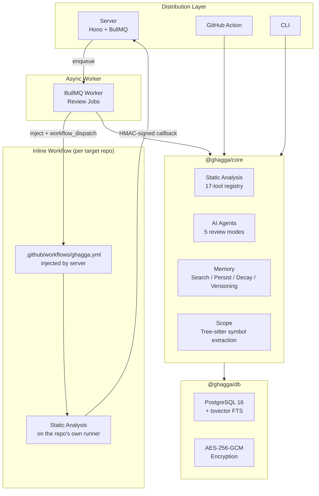

<p align="center">
  
</p>

<h1 align="center">GHAGGA</h1>

<p align="center">
  <strong>AI code review that learns your project — multi-agent orchestration, 17 static analysis tools, and persistent review memory.</strong>
</p>

<p align="center">
  <a href="https://www.npmjs.com/package/ghagga"></a>
  <a href="https://github.com/JNZader/ghagga/actions/workflows/ci.yml"></a>
  
  = 20" />
  
</p>

<p align="center">
  <a href="https://ghagga.javierzader.com/"><strong>Website</strong></a> ·
  <a href="https://ghagga.javierzader.com/docs/"><strong>Documentation</strong></a> ·
  <a href="https://ghagga.javierzader.com/app/"><strong>Live Dashboard</strong></a> ·
  <a href="https://github.com/apps/ghagga-review/installations/new"><strong>Install GitHub App</strong></a>
</p>

---

GHAGGA is a production AI code review system — not a prompt wrapper. One review engine, four delivery modes: a hosted **GitHub App**, a **GitHub Action**, a **CLI** for local pre-push review, and a fully **self-hosted** Docker deployment.

What makes it different:

- **Static analysis runs first.** 17 deterministic tools (Semgrep, Trivy, Gitleaks, Ruff, clippy, …) catch known issues before a single LLM token is spent. Findings are injected into the review prompt so the model focuses on logic and architecture.
- **It remembers.** Past decisions, bugfixes, and patterns persist across reviews (PostgreSQL, SQLite, or [Engram](https://github.com/Gentleman-Programming/engram)) and feed back into future ones — with full-text search, strength decay, and privacy stripping.
- **Five orchestration strategies.** From a fast single pass to multi-agent consensus voting, picked per review by cost/confidence tradeoff.
- **No runner infrastructure.** Server mode injects an inline GitHub Actions workflow into each target repo and dispatches it — heavy analysis runs on the repo's own free CI minutes, secured with per-dispatch HMAC secrets.

## By the Numbers

| | |
|---|---|
| **Production code** | ~48,000 lines of strict TypeScript across 7 workspaces |
| **Test code** | ~67,000 lines — *more test code than production code* |
| **Test suite** | 4,300+ test cases in 214 test files (Vitest), plus mutation testing with Stryker |
| **Static analysis** | 17 tools — 7 always-on, 10 auto-detected by stack |
| **Review modes** | 5 orchestration strategies (single-pass → multi-agent consensus) |
| **Distribution** | GitHub App (SaaS) · GitHub Action · npm CLI · self-hosted Docker |

## Architecture

A reusable core owns the review pipeline; thin adapters translate transport and IO. `@ghagga/core` knows nothing about HTTP, dashboard auth, or terminal rendering.



Every review follows the same pipeline, regardless of entry point:

```
diff → validate → parse & filter → detect stacks → token budget
     → static analysis + memory search → agent execution
     → merge findings → persist memory → ReviewResult
```

The pipeline degrades gracefully: missing tools, unreachable memory, or an unconfigured LLM never hard-fail a review.

## Quick Start

**GitHub App (hosted)** — install the [App](https://github.com/apps/ghagga-review/installations/new), configure your provider chain in the [dashboard](https://ghagga.javierzader.com/app/), open a PR.

**GitHub Action:**

```yaml
# .github/workflows/ghagga.yml
name: Code Review
on:
  pull_request:
    types: [opened, synchronize, reopened]
permissions:
  pull-requests: write
jobs:
  review:
    runs-on: ubuntu-latest
    steps:
      - uses: actions/checkout@v4
      - uses: JNZader/ghagga@v2.8.1
```

**CLI** — review local changes before they hit CI:

```bash
npm install -g ghagga
ghagga login
ghagga review --staged          # review staged changes
ghagga review --mode consensus  # multi-agent vote
ghagga health --top 10          # project health score
ghagga hooks install            # pre-commit + commit-msg hooks
```

**Self-hosted** — full stack with server, worker, PostgreSQL, and Redis:

```bash
git clone https://github.com/JNZader/ghagga.git
cd ghagga
cp .env.example .env
docker compose up -d
```

Full setup guides: [Quick Start](https://ghagga.javierzader.com/docs/quick-start) · [GitHub Action](https://ghagga.javierzader.com/docs/github-action) · [CLI](https://ghagga.javierzader.com/docs/cli) · [Configuration](https://ghagga.javierzader.com/docs/configuration)

## Review Modes

Five strategies with explicit cost/confidence tradeoffs:

| Mode | How it works | Token cost | Best for |
|------|--------------|:---:|----------|
| `simple` | Single LLM pass | ~1x | Small PRs, fast feedback |
| `consensus` | 3 stances (advocate / critic / observer) + algorithmic vote | ~3x | High-confidence approval decisions |
| `fan-out` | 5 independent lenses (security, typing, performance, a11y, error handling) merged by severity | ~5x | Broad category coverage, custom lenses |
| `workflow` | 5 specialists in parallel + synthesis step | ~6x | Thorough multi-angle reviews |
| `diagnostic` | Hypothesis-driven analysis with adaptive follow-up queries | varies | Digging into suspicious changes |

## Static Analysis — Layer 0

Deterministic checks run before the expensive stochastic layer. All tools are optional and skipped gracefully when missing.

- **Always-on (7):** Semgrep, Trivy, Gitleaks, ShellCheck, CPD, markdownlint, Lizard
- **Auto-detected by stack (10):** Ruff + Bandit (Python), golangci-lint (Go), Biome (JS/TS), clippy (Rust), PMD (Java), Psalm (PHP), Hadolint (Docker), zizmor (GitHub Actions), SonarQube (via MCP)

In server mode, this layer runs as an **inline workflow injected into the target repo** — no separate runner repository to provision, no RAM-hungry analysis on the API server. Callbacks are verified with per-dispatch HMAC-SHA256 secrets with TTL enforcement.

## Project Memory

The part that makes reviews compound over time:

- **Search before review** — relevant past observations are injected into prompts as context.
- **Persist after review** — significant findings are stored as typed observations (`decision`, `pattern`, `bugfix`, `architecture`, …) with deduplication.
- **Strength decay** — stale observations fade out of context instead of polluting it forever.
- **Versioning** — git-like branch / snapshot / merge / rollback over memory state.
- **Privacy stripping** — 16 redaction patterns (API keys, provider tokens, JWTs, PEM/SSH keys, env secrets, URL-embedded credentials) run before any write.

Backends: PostgreSQL (`tsvector` + `ts_rank`) for server mode, SQLite (FTS5 + BM25) for CLI/Action, or Engram over HTTP.

## Security

| Control | Implementation |
|---------|----------------|
| Provider API keys | AES-256-GCM encryption at rest, per-installation keys |
| GitHub webhooks | HMAC-SHA256 with constant-time comparison |
| Runner callbacks | Per-dispatch derived HMAC secrets + embedded-timestamp TTL |
| Memory writes | Privacy stripping (16 redaction patterns) |
| Outbound gateway URLs | SSRF guard — IP-range + DNS validation at persist time, re-validated at execution time |
| LLM prompts | Trust boundary — repo content, memory, and prior findings framed and sanitized as untrusted input |
| Job queue | Credentials never enter Redis payloads — workers re-fetch encrypted keys from PostgreSQL |
| Injected workflow | `permissions: contents: read`, secret masking, output normalization |
| Test coverage | Dedicated security suite: encryption tamper detection, HMAC correctness, no-secret-logging, no-eval, prototype-pollution checks |

## Monorepo

```text
ghagga/
├── packages/
│   ├── core/        # Review engine: agents, 17-tool registry, memory, tree-sitter scoping
│   ├── db/          # Drizzle schema, PostgreSQL queries, AES-256-GCM crypto, migrations
│   └── types/       # Shared API contracts
├── apps/
│   ├── server/      # Hono API + BullMQ workers + GitHub App integration
│   ├── action/      # GitHub Action runtime (SQLite memory via @actions/cache)
│   ├── cli/         # npm CLI: review, memory, hooks, health, audit, feedback
│   └── dashboard/   # React 19 SPA: provider chains, review history, memory browser
├── templates/       # Inline static-analysis workflow template
└── docs/            # Documentation site (GitHub Pages)
```

**Stack:** TypeScript (strict) · Hono · BullMQ + Redis · PostgreSQL 16 + Drizzle · React 19 + Vite + Tailwind 4 · Vitest + Stryker · Biome · pnpm + Turborepo

**LLM providers:** everything routes through a provider chain with ordered fallback — `gateway` (any model via [mcp-llm-bridge](https://github.com/JNZader/mcp-llm-bridge)), `cli-bridge` (local Claude / Gemini / Copilot CLIs), or `ollama` (local models).

## Engineering Notes

A few decisions worth calling out:

- **Core/adapter split.** The review engine is transport-agnostic; server, Action, and CLI are thin IO translators. Adding a delivery mode doesn't touch the pipeline.
- **Tests outweigh production code** (~67k vs ~48k LOC), with mutation testing (Stryker) guarding the core, server, and Action against assertion-free tests.
- **v2 was a real rewrite**, not a patch: v1's Deno + Node + Python sprawl collapsed into a single-runtime Node monorepo with async orchestration (BullMQ), a 17-tool registry (up from Semgrep-only), and an actually-used memory system.
- **Graceful degradation everywhere.** Missing static tools, unreachable memory backends, blocked workflow injection — every layer falls back instead of failing the review.

## Development

```bash
pnpm install
docker compose up postgres redis -d
cp .env.example .env
pnpm --filter ghagga-db db:push
pnpm exec turbo typecheck build test
```

Deep dives live in the [documentation site](https://ghagga.javierzader.com/docs/): [Architecture](https://ghagga.javierzader.com/docs/architecture) · [Memory System](https://ghagga.javierzader.com/docs/memory-system) · [API Reference](https://ghagga.javierzader.com/docs/api-reference) · [Database Schema](https://ghagga.javierzader.com/docs/database-schema)

## Credits

Inspired by [Gentleman Guardian Angel (GGA)](https://github.com/Gentleman-Programming/gentleman-guardian-angel) and [Engram](https://github.com/Gentleman-Programming/engram) by [Gentleman Programming](https://youtube.com/@GentlemanProgramming).

## License

MIT. See [LICENSE](LICENSE).
