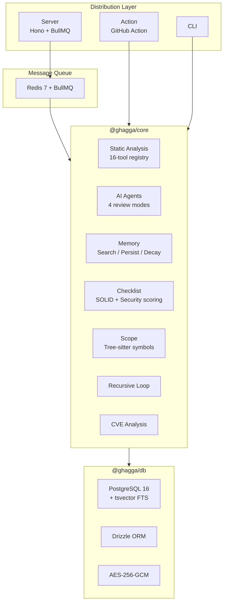

<p align="center">
  
</p>

<h1 align="center">GHAGGA</h1>

<p align="center">
  <strong>AI-Powered Code Review with Static Analysis & Project Memory</strong>
</p>

<p align="center">
  Multi-agent reviewer that posts intelligent comments on your Pull Requests.<br/>
  Combines LLM analysis with 16 static analysis tools and memory that learns across reviews.
</p>

<p align="center">
  
  
  
  
</p>

<p align="center">
  <a href="https://ghagga.javierzader.com/"><strong>Website</strong></a> &middot;
  <a href="https://ghagga.javierzader.com/docs/"><strong>Docs</strong></a> &middot;
  <a href="https://ghagga.javierzader.com/app/"><strong>Dashboard</strong></a>
</p>

<!-- TODO: Add hero screenshot/GIF here showing a PR review comment -->
<!-- Recommended: 800x450 animated GIF of a real GHAGGA review on a PR -->

---

## Try It Now

**Easiest way**: [Install the GitHub App](https://github.com/apps/ghagga-review/installations/new) &rarr; [Configure in Dashboard](https://ghagga.javierzader.com/app/) &rarr; Open a PR &rarr; Get an AI review in ~1-2 min.

No LLM key required for static-analysis-only mode. GitHub Models (free) supported out of the box.

---

## How It Works

1. **Receives** a PR diff (via webhook, CLI, or GitHub Action)
2. **Scans** with 16 static analysis tools &mdash; zero LLM tokens for known issues
3. **Searches** project memory for past decisions, patterns, and bug fixes
4. **Sends** diff + static analysis context + memory to AI agents
5. **Posts** a structured review comment with findings, severity, and suggestions
6. **Learns** by extracting observations and storing them for next time

<!-- TODO: Add pipeline diagram screenshot or simplified flow visual here -->

---

## Quick Start

### GitHub Action (Free for Public Repos)

```yaml
# .github/workflows/ghagga.yml
name: Code Review
on:
  pull_request:
    types: [opened, synchronize, reopened]
permissions:
  pull-requests: write
jobs:
  review:
    runs-on: ubuntu-latest
    steps:
      - uses: actions/checkout@v4
      - uses: JNZader/ghagga-action@v1
```

### CLI

```bash
npm install -g ghagga
ghagga login          # Authenticate with GitHub (free AI models)
ghagga review         # Review staged changes
ghagga health ./src   # Project health check
ghagga memory list    # Browse review memory
```

### Self-Hosted (Docker on Coolify)

```bash
git clone https://github.com/JNZader/ghagga.git
cd ghagga && cp .env.example .env  # Edit .env
docker compose up -d               # PostgreSQL + Redis + Server + Worker
```

> [Full setup guides](https://ghagga.javierzader.com/docs/) for SaaS, Action, CLI, and self-hosted.

---

## Features

| Feature | Description |
|---------|-------------|
| **4 Review Modes** | Simple (single LLM), Workflow (5 specialist agents), Consensus (3 perspectives + voting), Fan-out (5 lenses in parallel) |
| **16 Static Analysis Tools** | Semgrep, Trivy, CPD, Gitleaks, ShellCheck, markdownlint, Lizard + 9 auto-detect &mdash; zero tokens |
| **Static-Only Fallback** | Runs all tools without LLM when no API key is configured |
| **Project Memory** | Learns across reviews (PostgreSQL + tsvector, SQLite + FTS5, or Engram backend) |
| **6 LLM Providers** | Anthropic, OpenAI, Google, GitHub Models (free), Ollama (local), Qwen + 4 more |
| **3 Distribution Modes** | Self-hosted (Coolify), GitHub Action, CLI |
| **PR Commands** | `/ghagga review`, `/ghagga security`, `/ghagga perf`, `/ghagga describe`, `/ghagga fan-out` |
| **Tree-sitter Scoping** | Symbol-level review scoping (TS, JS, Python, Go) |
| **Recursive Review** | Re-reviews suggested patches to catch regressions (max 2 iterations) |
| **Memory Decay & Versioning** | 3-phase strength decay + git-style branching with contradiction detection |
| **CVE Exploitability** | Reachability-aware labeling: exploitable, potentially-exploitable, not-exploitable |
| **Delegated CI** | Auto-discovers CI jobs and orchestrates on user-owned runners |
| **BYOK Security** | AES-256-GCM encryption, HMAC-SHA256 webhooks, 13-pattern privacy stripping |

---

## Review Modes

| Mode | How | Tokens | Best For |
|------|-----|--------|----------|
| **Simple** | Single LLM call | ~1x | Quick reviews, small PRs |
| **Workflow** | 5 specialists + synthesis | ~6x | Thorough reviews, large PRs |
| **Consensus** | 3 perspectives + algorithmic vote | ~3x | Critical paths, high-confidence decisions |
| **Fan-out** | 5 lenses in parallel + merge | ~5x | Broad coverage across categories |

---

## Architecture



> [Full architecture docs](https://ghagga.javierzader.com/docs/) &mdash; runner architecture, core+adapters pattern, pipeline details.

<!-- TODO: Add architecture diagram PNG/SVG as visual alternative to mermaid -->

---

## Memory System

GHAGGA learns from past reviews using full-text search. Patterns inspired by [Engram](https://github.com/Gentleman-Programming/engram), implemented in PostgreSQL for multi-tenancy.

| Backend | Used By | Search Engine |
|---------|---------|---------------|
| **PostgreSQL** | Server (SaaS/self-hosted) | `tsvector` + GIN index |
| **SQLite** (sql.js WASM) | CLI, GitHub Action | FTS5 + BM25 |
| **Engram** | CLI (optional) | External HTTP API |

**Observation types**: decision, pattern, bugfix, learning, architecture, config, discovery. 13-pattern privacy stripping on all stored data. 3-phase strength decay (active &rarr; decaying &rarr; cleared). Git-style branching with contradiction detection on merge.

> [Memory system docs](docs/memory-system.md)

---

## Dashboard

React 19 SPA on GitHub Pages with dark theme, review history, stats, settings, and memory browser.

<!-- TODO: Add dashboard screenshot here -->
<!-- Recommended: 1200x600 screenshot of the Dashboard page with review stats -->

**Live**: [https://ghagga.javierzader.com/app/](https://ghagga.javierzader.com/app/)

---

## Security

| Measure | Implementation |
|---------|---------------|
| API key encryption | AES-256-GCM with per-installation keys |
| Webhook verification | HMAC-SHA256 with `timingSafeEqual` |
| Privacy stripping | 13 regex patterns remove secrets before storage |
| BYOK model | Users provide their own keys &mdash; never stored in plaintext |
| LLM timeout | 60-second timeout with provider fallback chain |
| Installation scoping | Routes scoped by GitHub installation ID |
| Correlation IDs | End-to-end tracing from webhook to PR comment |

> 14 dedicated security audit tests in the suite. See [Security](SECURITY.md) for reporting.

---

## Tech Stack

| Layer | Technology | Why |
|-------|-----------|-----|
| **Monorepo** | pnpm workspaces + Turborepo | Fast installs, parallel builds, caching |
| **Language** | TypeScript 5.9 (strict mode) | Type safety across all packages |
| **Backend** | Hono 4 | Fastest TS framework, 14KB, runs anywhere |
| **Database** | PostgreSQL 16 + Drizzle ORM | Zero-overhead SQL, tsvector FTS |
| **Queue** | BullMQ 5 + Redis 7 | Reliable job processing, configurable concurrency |
| **AI** | Vercel AI SDK 6 | 6 providers, streaming, fallback chains |
| **Frontend** | React 19 + Vite 7 + Tailwind CSS 4 | Lazy routes, vendor splitting, dark theme |
| **Data** | TanStack Query 5 | Caching, background refetching |
| **CLI** | Commander 14 + Clack prompts | Standard CLI + interactive TUI |
| **Testing** | Vitest 4 | Fast, ESM-native, Jest-compatible |
| **Static Analysis** | 16-tool plugin registry | Security, SCA, duplication, lint &mdash; zero tokens |
| **Encryption** | Node.js `crypto` (AES-256-GCM) | No external crypto dependencies |
| **Deployment** | Coolify on Hetzner VPS | Self-hosted Docker orchestration |

> [Why these choices](https://ghagga.javierzader.com/docs/) &mdash; Vercel AI SDK over LangGraph, Hono over Express, Drizzle over Prisma, PostgreSQL memory over Engram standalone.

---

## Monorepo Structure

```
ghagga/
├── packages/
│   ├── core/            # Review engine (pipeline, agents, tools, memory, scope)
│   ├── db/              # Database layer (Drizzle ORM, migrations, crypto)
│   └── types/           # Shared API types
├── apps/
│   ├── server/          # Hono API + BullMQ workers
│   ├── dashboard/       # React 19 SPA (GitHub Pages)
│   ├── cli/             # npm: ghagga (Commander + Clack TUI)
│   └── action/          # GitHub Action (node20 runtime)
├── templates/           # Runner dispatch templates
├── landing/             # Marketing site (GitHub Pages)
├── docs/                # Docsify documentation site
└── openspec/            # Spec-Driven Development artifacts
```

---

## Development

```bash
git clone https://github.com/JNZader/ghagga.git && cd ghagga
pnpm install
docker compose up postgres redis -d
cp .env.example .env      # Edit with your credentials
pnpm --filter ghagga-db db:push
pnpm --filter @ghagga/server dev
pnpm --filter @ghagga/dashboard dev   # In another terminal
```

```bash
pnpm exec turbo typecheck   # Typecheck all packages
pnpm exec turbo build       # Build all packages
pnpm exec turbo test        # Run all tests (comprehensive, 4 audit rounds)
```

---

## What Changed from v1

GHAGGA v2 is a **complete rewrite**. v1 (~11,000 lines) is preserved on `main-bkp`.

| Aspect | v1 | v2 |
|--------|----|----|
| Runtime | Deno + Node.js + Python | Node.js only |
| Database | Supabase (hosted) | PostgreSQL 16 (self-hosted) |
| Async | None (inline webhook) | BullMQ + Redis |
| Tests | 0 | Comprehensive suite (Vitest) |
| Distribution | 1 (webhook) | 3 (Self-hosted, Action, CLI) |
| Static analysis | Semgrep only (Python microservice) | 16 tools via plugin registry |
| Memory | Stored but never consumed | Full pipeline: search &rarr; inject &rarr; review &rarr; persist |
| Dead code | ~40% | 0% |

---

## Credits

Inspired by [Gentleman Guardian Angel (GGA)](https://github.com/Gentleman-Programming/gentleman-guardian-angel) and [Engram](https://github.com/Gentleman-Programming/engram) by [Gentleman Programming](https://youtube.com/@GentlemanProgramming).

---

## License

MIT &mdash; see [LICENSE](LICENSE) for details.

<!-- GitHub Topics: code-review, ai, llm, static-analysis, github-action, cli-tool, typescript, hono, react, bullmq, postgresql, multi-agent -->