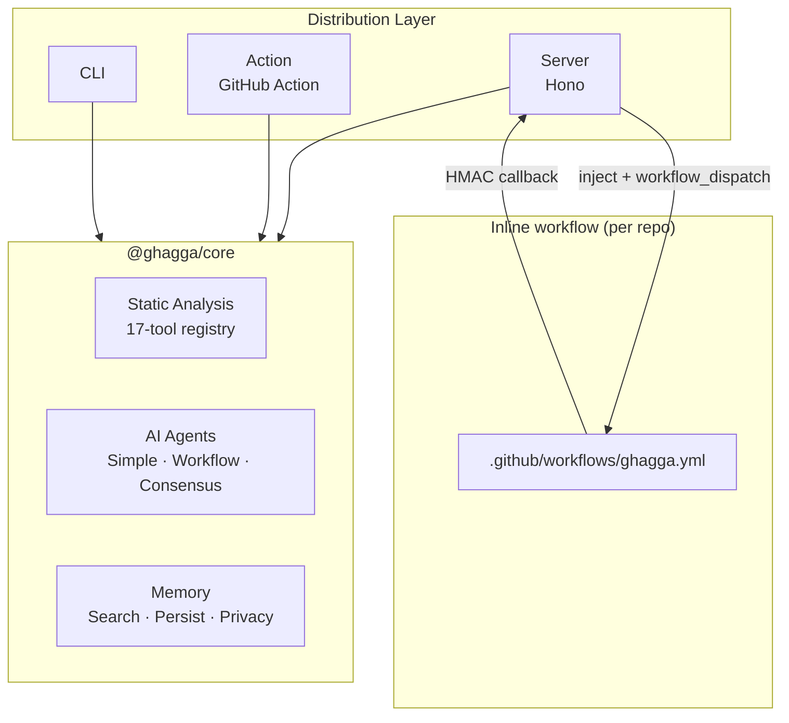

# GHAGGA

> **AI-Powered Multi-Agent Code Review**

GHAGGA is a code review tool that posts comments on pull requests. It combines LLM analysis, a 17-tool static-analysis registry, and project memory.

## New Here? Start with Your Guide

| Your situation | Start here |
|---|---|
| **I want the easiest setup** | [SaaS Guide (GitHub App)](saas-getting-started.md) ⭐ Recommended |
| I want CI/CD integration | [GitHub Action](github-action.md) |
| I want local CLI reviews | [CLI](cli.md) |
| I want to self-host | [Self-Hosted (Docker)](self-hosted.md) |
| I just want to explore | Keep reading below, then check [Quick Start](quick-start.md) |

## How It Works

1. **Receives** a PR diff (via webhook, CLI, or GitHub Action)
2. **Scans** it with static analysis tools — zero LLM tokens for known issues
3. **Searches** project memory for past decisions, patterns, and bug fixes
4. **Sends** the diff + static findings + memory to AI agents
5. **Posts** a structured review comment with findings, severity, and suggestions
6. **Learns** by extracting observations and storing them for next time

## Key Features

| Feature | Description |
|---------|-------------|
| **6 Review Modes** | `simple`, `workflow`, `consensus`, `diagnostic`, `fan-out`, `hybrid-4r` |
| **17 Static Analysis Tools** | 7 always-on, 10 auto-detect. SonarQube runs only with MCP |
| **Inline Static-Analysis Workflow** | Server injects `.github/workflows/ghagga.yml` into each target repo and dispatches it — no separate runner repo to provision |
| **Project Memory** | Learns patterns, decisions, and bug fixes across reviews. 3 backends: PostgreSQL + tsvector (Server), SQLite + FTS5 (CLI & Action), Engram (optional cross-tool sharing) |
| **3 Provider Modes** | `gateway`, `cli-bridge`, `ollama`. Legacy names such as `github` remap to `gateway` |
| **4 Distribution Modes** | GitHub App, GitHub Action, CLI, self-hosted |
| **Comment Trigger** | Type `ghagga review` on any PR to re-trigger a review on demand |
| **Dashboard** | React SPA at `/app/` on the Pages deploy — review history, stats, settings, memory browser |
| **BYOK Security** | AES-256-GCM encryption, HMAC-SHA256 webhook verification, privacy stripping |

## Architecture at a Glance

The review engine (`@ghagga/core`) is distribution-agnostic. Each app is a thin adapter that feeds diffs into the core and handles I/O.

## Quick Links

- **[Quick Start](quick-start.md)** — Get running in 5 minutes
- **[SaaS Guide](saas-getting-started.md)** — GitHub App setup (easiest)
- **[GitHub Action](github-action.md)** — CI/CD integration
- **[CLI](cli.md)** — Review local changes from your terminal
- **[Self-Hosted](self-hosted.md)** — Full deployment with Docker

## Origins

GHAGGA is a complete rewrite of [Gentleman Guardian Angel (GGA)](https://github.com/Gentleman-Programming/gentleman-guardian-angel) by [Gentleman Programming](https://youtube.com/@GentlemanProgramming). Memory system design patterns inspired by [Engram](https://github.com/Gentleman-Programming/engram).
