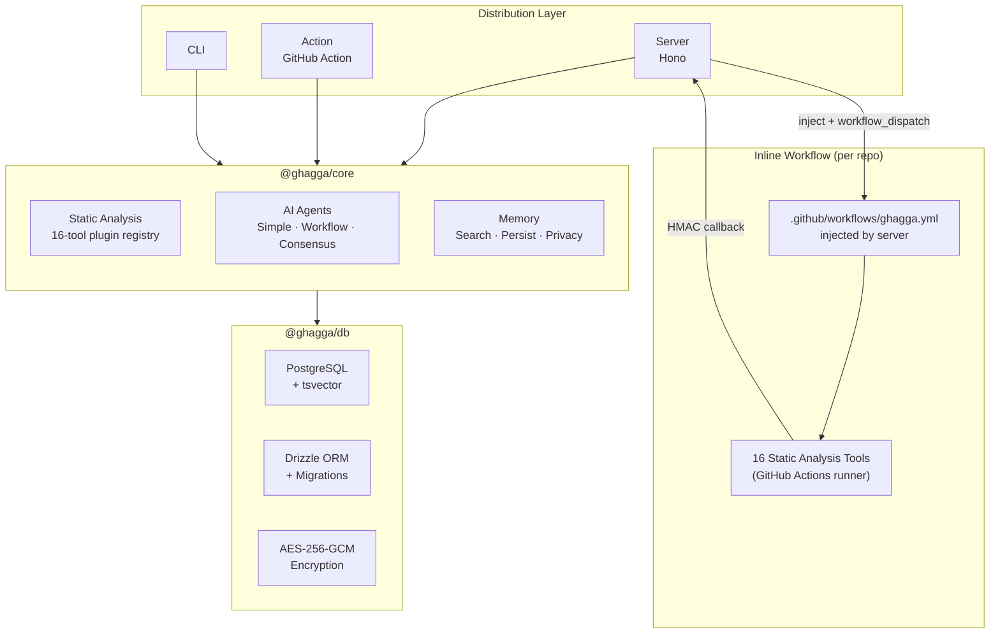
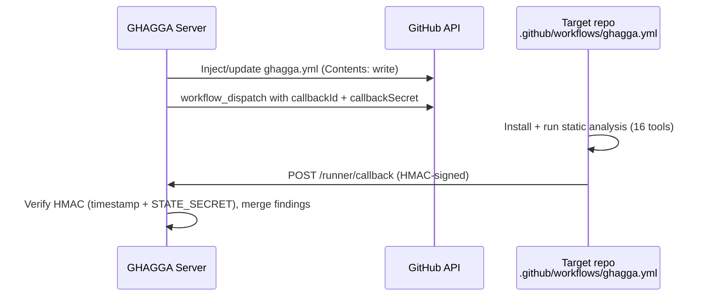

# Architecture

## Core + Adapters Pattern

GHAGGA uses a **Core + Adapters** architecture. The review engine (`@ghagga/core`) is pure logic with zero I/O dependencies — it knows nothing about HTTP, webhooks, or CLI. Each distribution mode is a thin adapter.



## Adapter Responsibilities

Each adapter does the minimum work necessary to bridge between its I/O world and the core engine:

| Adapter | Input | Output | Memory | Static Analysis |
|---------|-------|--------|--------|----------------|
| **Server** | GitHub webhook | PR comment via GitHub API | Yes (PostgreSQL) | Injected inline workflow on the target repo |
| **Action** | PR event in GitHub Actions | PR comment via Octokit | Yes (SQLite) | Direct on the Actions runner |
| **CLI** | Local `git diff` | Terminal output (markdown/json/sarif) | Yes (SQLite or Engram) | If installed locally |

> Memory uses PostgreSQL + tsvector FTS in Server mode, SQLite (via `sql.js` WASM) with FTS5 in Action mode, and SQLite or [Engram](https://github.com/Gentleman-Programming/engram) in CLI mode (`--memory-backend engram`). All three backends implement the same `MemoryStorage` interface. Content is deduplicated via SHA-256 hashing with a 15-minute dedup window, and all data passes through `stripPrivateData()` (13 regex patterns) before storage. See [Memory System](memory-system.md) for full details.

## Monorepo Structure

```
ghagga/
├── packages/
│   ├── core/           # @ghagga/core — Review engine (zero I/O)
│   │   └── src/
│   │       ├── pipeline.ts     # Main orchestrator
│   │       ├── types.ts        # All TypeScript interfaces
│   │       ├── agents/         # Simple, Workflow, Consensus
│   │       ├── tools/          # 16-tool plugin registry
│   │       ├── memory/         # Search, persist, privacy, engram.ts
│   │       ├── providers/      # Vercel AI SDK multi-provider
│   │       └── utils/          # Diff parsing, stack detect, tokens
│   ├── db/             # @ghagga/db — Database layer
│   │   └── src/
│   │       ├── schema.ts       # Drizzle table definitions
│   │       ├── crypto.ts       # AES-256-GCM encrypt/decrypt
│   │       └── queries.ts      # Typed database queries
│   └── types/          # @ghagga/types — Shared TypeScript interfaces
├── apps/
│   ├── server/         # Hono API (webhook + REST + BullMQ + runner)
│   │   └── Dockerfile  # Multi-stage with 16 static analysis tools
│   ├── dashboard/      # React SPA (GitHub Pages)
│   ├── cli/            # CLI tool (Commander.js)
│   └── action/         # GitHub Action (node20 + Docker)
│
├── templates/                 # Inline static-analysis workflow template
│   └── ghagga-inline.yml         # Injected at .github/workflows/ghagga.yml in target repos
└── docker-compose.yml  # PostgreSQL + Redis + server + worker
```

## Inline Static-Analysis Workflow

Static analysis runs as an **inline GitHub Actions workflow** that the server injects into each target repository at `.github/workflows/ghagga.yml` (built from `templates/ghagga-inline.yml`). There is no separate runner repository — the workflow runs in the PR's own repo on GitHub Actions infrastructure.



Per-dispatch callback secrets are derived deterministically as `HMAC-SHA256(STATE_SECRET, callbackId)` (no in-memory state), and the `callbackId` embeds a base-36 timestamp so callbacks older than `CALLBACK_TTL_MINUTES` (default 11) are rejected. If workflow injection is blocked (branch protection, missing permissions, etc.), the server falls back to LLM-only review (no static analysis).

## Design Decisions

### Vercel AI SDK over LangChain/LangGraph

GHAGGA's review flow is **predictable** (Layer 0 → 1 → 2 → 3), not a dynamic graph. Vercel AI SDK gives multi-provider support (6 providers: GitHub Models, Anthropic, OpenAI, Google, Ollama, Qwen) with streaming, structured output, and tool calling — without the overhead of graph management.

### Hono over Express/Fastify

Hono is the fastest TypeScript framework at ~14KB. It runs on Node.js, Bun, Deno, and Cloudflare Workers. Express is legacy, Fastify is heavier than needed for this use case.

### Drizzle ORM over Prisma

Zero-overhead SQL with excellent TypeScript inference. No binary dependencies (unlike Prisma). Supports raw tsvector operations for the memory system's full-text search.

### PostgreSQL Memory over Engram

[Engram](https://github.com/Gentleman-Programming/engram) has great design patterns (session model, topic-key upserts, deduplication, privacy stripping) but no multi-tenancy, no auth, and is SQLite single-writer. We adopted its patterns directly in PostgreSQL.

### BullMQ over Inngest

GHAGGA migrated from Inngest (SaaS) to BullMQ + Redis (self-hosted). BullMQ eliminates the external SaaS dependency, runs entirely on infrastructure we control (Hetzner VPS), and uses Redis as a battle-tested job queue backend. No vendor lock-in, no event quotas, no external webhooks to register. The worker process runs alongside the API server in the same docker-compose stack.

### Provider Chain Filtering in SaaS Mode

In SaaS mode, the server uses GitHub App **installation tokens** (`ghs_*`) to authenticate with GitHub. These tokens do **not** have the `models:read` scope required by GitHub Models. As a result, the server silently filters out `github` provider entries from the provider chain when no explicit PAT is configured for that entry.

If a user adds "GitHub Models" to their provider chain in the Dashboard without providing a PAT with `models:read`, the entry is skipped at review time and the next provider in the chain is used instead. A warning is logged on the server side. This does **not** affect CLI or GitHub Action modes, where a user-controlled GitHub token is used directly.

### Binary Execution for Static Analysis

All static analysis tools are called as child processes — no separate microservices, no network latency, no SSRF concerns. Tool outputs (JSON, XML, or text) are parsed locally into a common `ReviewFinding` format.
