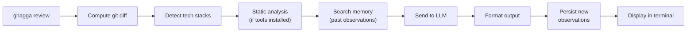

# CLI Guide

Review local code changes from your terminal with AI-powered analysis. The CLI is the fastest way to get feedback before you push — no server, no CI pipeline, no Docker required.

> **Not looking for the CLI?** If you want zero-config SaaS, try the [GitHub App](saas-getting-started.md). For automated PR reviews, see the [GitHub Action](github-action.md). For full self-hosted control, see the [Self-Hosted Guide](self-hosted.md).

---

## When to Choose the CLI

The CLI is best for:

- **Local development** — review changes before committing or pushing
- **Pre-commit hooks** — automatic review on every commit via `ghagga hooks install`
- **Pre-push checks** — catch issues before they hit CI
- **CI/CD pipelines** — integrate reviews into any pipeline with exit codes
- **Reviewing specific files** — target a directory or subdirectory with `ghagga review ./src`

---

## Prerequisites

- **Node.js >= 20.0.0** (check: `node --version`)
- **Git** (required for computing diffs)
- **A GitHub account** (required for `ghagga login` and free GitHub Models access)

---

## Cost

| Component | Cost |
|-----------|------|
| **GHAGGA CLI** | Free and open source (MIT license) |
| **GitHub Models** (`gpt-4o-mini`) | **Free** — default provider, no API key needed |
| **Ollama** | **Free** — runs locally, 100% offline, no API key |
| **Other LLM providers** (Anthropic, OpenAI, Google, Qwen) | BYOK — you pay those providers directly at their standard rates |
| **Static analysis** (up to 16 tools) | Free — runs locally if installed |

> 💡 **TL;DR**: 100% free with `ghagga login` (GitHub Models) or `--provider ollama` (local). No credit card, no signup beyond GitHub.

---

## Step 1: Install

Install globally or use `npx` (no install required):

```bash
# Option A: Global install
npm install -g ghagga

# Option B: Run directly with npx (no install)
npx ghagga --version
```

> ✅ **Verification**: Run `ghagga --version` (or `npx ghagga --version`). You should see the version number (e.g., `2.5.0`).

---

## Step 2: Login

Authenticate with GitHub to get free access to AI models via [GitHub Models](https://github.com/marketplace/models):

```bash
ghagga login
```

The login process uses **GitHub Device Flow**:

1. The CLI displays a one-time code and opens your browser to `https://github.com/login/device`
2. Enter the code in the browser and click **"Authorize"**
3. The CLI detects authorization and saves your token

Your credentials are stored at `~/.config/ghagga/config.json` (following the [XDG Base Directory](https://specifications.freedesktop.org/basedir-spec/latest/) specification).

> ✅ **Verification**: Run `ghagga status`. You should see `Auth: Logged in` with your GitHub username.

---

## Step 3: Review Your Code

Make some code changes (staged or uncommitted), then:

```bash
ghagga review
```

The CLI computes a `git diff`, sends it to the AI, and prints the review to your terminal.

> 💡 **Tip**: If you see "No changes detected", stage some changes with `git add` or make uncommitted edits.

> ✅ **Verification**: You should see the GHAGGA review output with status, summary, and findings.

---

## Step 4: Explore Options

```bash
# Thorough review with 5 specialist agents
ghagga review --mode workflow

# JSON output for CI integration
ghagga review --output json | jq '.status'

# See real-time progress of each pipeline step
ghagga review --mode workflow --verbose

# Review a specific directory
ghagga review ./src

# Use a local Ollama model (100% offline, free)
ghagga review --provider ollama --model qwen2.5-coder:7b
```

> ✅ **Verification**: Try `ghagga review --verbose` to see each step of the pipeline in real time.

---

## How It Works



1. The CLI runs `git diff` (staged changes first, then falls back to uncommitted changes; `--staged` forces `git diff --cached` only)
2. The diff is parsed and the tech stack is auto-detected from file extensions
3. If static analysis tools are installed locally, they run first (zero LLM tokens) — up to 16 tools via the plugin registry
4. Relevant observations are retrieved from the local memory database via FTS5 full-text search
5. The diff + static findings + memory context are sent to the configured LLM provider (default: GitHub Models `gpt-4o-mini`)
6. The LLM returns a structured review with findings, severity, and suggestions
7. New observations (decisions, patterns, bugs) are extracted and persisted to memory
8. The result is formatted as markdown (default) or JSON and printed to stdout

### Git Hooks Workflow

When git hooks are installed via `ghagga hooks install`, the review runs automatically on each commit:

- **pre-commit**: Runs `ghagga review --staged --plain --exit-on-issues`. Uses `--quick` mode by default for fast feedback (~5-10s). If critical/high issues are found, the commit is blocked.
- **commit-msg**: Runs `ghagga review --commit-msg <file> --plain --exit-on-issues`. Validates message format (empty, too short, subject >72 chars, trailing period, missing body separation).

Hooks auto-detect `ghagga` in PATH and skip gracefully if not found, so they won't break your workflow if GHAGGA is uninstalled.

> 💡 **Memory**: The CLI includes a local SQLite memory database (via `sql.js` WASM) stored at `~/.config/ghagga/memory.db`. Past observations are searched using FTS5 full-text search and injected into agent prompts, just like the Server mode. Observations from each review are persisted locally so your project memory grows over time. Use `--no-memory` to disable memory for a single review, or manage stored observations with `ghagga memory`. Alternatively, use `--memory-backend engram` to store observations in [Engram](https://github.com/Gentleman-Programming/engram), enabling cross-tool memory sharing with Claude Code, OpenCode, Gemini CLI, and other Engram-compatible tools. If Engram is unreachable, the CLI falls back to SQLite automatically.

---

## Commands

The CLI has 7 commands:

### `ghagga login`

Authenticate with GitHub using Device Flow. Stores your token at `~/.config/ghagga/config.json` and sets the default provider to `github` with model `gpt-4o-mini` (free).

```bash
ghagga login
```

If you're already logged in, the CLI shows your username and suggests `ghagga logout` to switch accounts.

### `ghagga logout`

Clear stored credentials from `~/.config/ghagga/config.json`.

```bash
ghagga logout
```

### `ghagga status`

Show current authentication and configuration:

```bash
ghagga status
```

Example output:

```
🤖 GHAGGA Status

   Config: /home/user/.config/ghagga/config.json
   Auth:   Logged in as octocat
   Provider: github
   Model:    gpt-4o-mini
   Session: Valid (octocat)
```

### `ghagga review [path]`

Run an AI code review on local changes. This is the main command.

```bash
# Review changes in current directory (default)
ghagga review

# Review changes in a specific directory
ghagga review ./src

# Review with all options
ghagga review --mode workflow --provider openai --api-key sk-xxx --verbose
```

### `ghagga memory`

Inspect, search, and manage the local review memory database. See [Memory Subcommands](#memory-subcommands) below for full details.

```bash
# List stored observations
ghagga memory list

# Search observations
ghagga memory search "error handling"

# Show database statistics
ghagga memory stats
```

### `ghagga hooks`

Install, uninstall, and check status of git hooks for automated code review on commit.

#### `ghagga hooks install [--force] [--pre-commit] [--commit-msg]`

Install GHAGGA-managed git hooks in the current repository. By default, installs both `pre-commit` and `commit-msg` hooks. Use `--pre-commit` or `--commit-msg` to install only one.

```bash
ghagga hooks install                  # Install both hooks
ghagga hooks install --pre-commit     # Only pre-commit hook
ghagga hooks install --commit-msg     # Only commit-msg hook
ghagga hooks install --force          # Overwrite existing hooks (backs up originals)
```

- Hooks auto-detect `ghagga` in PATH and fail gracefully if not found.
- `--force` backs up existing hooks (e.g., `pre-commit.bak`) before overwriting.
- Installed hooks use `--plain --exit-on-issues` automatically.

#### `ghagga hooks uninstall`

Remove GHAGGA-managed hooks from the current repository.

```bash
ghagga hooks uninstall
```

#### `ghagga hooks status`

Show the current status of git hooks in the repository (installed, not installed, or third-party).

```bash
ghagga hooks status
```

### `ghagga health [path]`

Run a project health assessment. Computes a health score (0-100), shows historical trends, and provides actionable recommendations.

```bash
# Basic health check
ghagga health

# Health check on a specific directory
ghagga health ./src

# Show top 10 issues
ghagga health --top 10
```

Options:

| Option | Default | Description |
|--------|---------|-------------|
| `[path]` | `.` | Path to repository or subdirectory |
| `--top <n>` | `5` | Number of top issues to display |

The health command inherits `--output json` from global options for CI integration. See [Health Check](health.md) for full details.

### `ghagga index [path]`

Build the dependency graph consumed by blast-radius and review (`.ghagga/graph.json`).

By default this uses a **SCIP-backed backend** for compiler-grade cross-file resolution, covering 8 languages across per-language maturity tiers:

| Maturity | Languages | Indexer(s) | Notes |
|----------|-----------|------------|-------|
| `stable` | Go, TypeScript/JavaScript, Rust | `scip-go`, `scip-typescript`, `rust-analyzer` | Captured fixtures, validated in CI |
| `stable`\* | Python | `scip-python` | Entry shipped; fixture capture is deferred — scip-python 0.6.6 emits 0 documents in some environments |
| `heavy` | Java, Kotlin | `scip-java` (shared indexer) | Needs a Maven or Gradle build in the target repo; Kotlin support is Gradle-only |
| `experimental` | C# | `scip-dotnet` | Immature upstream indexer (0.2.x) |
| `experimental` | PHP | `scip-php` | Solo-maintained upstream indexer |

\* Registered and dispatched like any other stable entry — only the fixture capture for the test suite is deferred, not the runtime support.

`ghagga index` auto-detects which languages are present in the target repo via marker files (`go.mod`, `package.json`/`tsconfig.json`, `pyproject.toml`/`requirements.txt`/`setup.py`, `Cargo.toml`, `pom.xml`/`build.gradle`/`build.gradle.kts`, `*.csproj`/`*.sln`, `composer.json`), checks each detected language's toolchain, runs every available indexer to an isolated `.scip` output, and merges the results into ONE graph. A missing indexer/toolchain for a detected language **warns and skips that language** rather than aborting the whole run.

#### Nested marker detection

Marker files are detected at **any depth** below repo root, not just repo root itself — a monorepo with `apps/backend/go.mod` and `services/worker/go.mod` (and no root-level `go.mod`) gets BOTH indexed, as does a repo mixing a root-level `package.json` with a nested `pyproject.toml`. This matters because most indexers (Go, Rust, Java, C#, PHP) cannot self-discover nested modules from an ancestor working directory — `ghagga index` runs each of them once **per marker directory found**, then merges all runs into one repo-relative graph.

- **Depth bound**: the walk descends up to **4 levels** below repo root by default (covers `apps/*/`, `services/*/`, and one level of `packages/x/y`-style nesting). A marker nested deeper than that is silently not detected — this is a known limitation. There is no CLI flag to override the depth yet (tracked as a follow-up); it's configurable at the API level via `detectMarkerDirectories(repoPath, { maxDepth })`.
- **Excluded directories**: the walk always skips `node_modules`, `vendor`, `.git`, `__pycache__`, `target`, `build`, `dist`, `.next`, `.turbo`, `.worktrees`, `.ghagga`, and `.tools` — this is what keeps a `.tools/codeql/` with 100k+ files, or a `.worktrees/` full of parallel git checkouts, from blowing up the walk.
- **Output isolation**: two marker directories of the SAME indexer (e.g. Python markers in both `apps/ml-service` and `services/ai-assistant`) never clobber each other's `.scip` output — each nested run gets a directory-disambiguated output path, and the merge step disambiguates identically-named documents (e.g. two `main.py`) by their source subdirectory before building the graph.
- **Run-count cap**: per-marker-directory indexer runs are capped at **25** by default, but this cap applies ONLY to **nested** marker directories — root-level markers (e.g. a root `pom.xml` or `*.csproj`) are NEVER dropped and always run, no matter how many nested markers are found. Nested runs are sorted `stable` → `heavy` → `experimental` maturity, then depth ascending, BEFORE capping — so cheap, reliable indexers never get crowded out by expensive/immature ones, and a pathological monorepo degrades predictably rather than hanging. Beyond the cap, a warning names exactly which nested marker directories were skipped.
- **scip-typescript is the one exception**: unlike every other indexer, `scip-typescript --infer-tsconfig` already recursively discovers and indexes every nested TS/JS package when run once from repo root (verified empirically — it resolves cross-package project-reference imports correctly and emits clean repo-relative paths, even with no tsconfig.json at repo root at all). So TypeScript/JavaScript always runs exactly ONCE, at repo root, regardless of how many nested `package.json`/`tsconfig.json` marker directories were found — running it again per nested directory would double-index for no benefit.
- **Per-directory graceful degradation**: a runtime failure of an indexer in ONE marker directory warns and skips only that directory — it does not abort indexing of the other marker directory (same language) or any other language.

```bash
# Install one or more indexer toolchains (one-time, only for the languages you use)
go install github.com/scip-code/scip-go/cmd/scip-go@latest
npm install -g @sourcegraph/scip-typescript
npm install -g @sourcegraph/scip-python
rustup component add rust-analyzer

# Index the current repository (multi-language: indexes every detected+available language)
ghagga index

# Index a specific directory
ghagga index ./services/api

# Write the graph to a custom location
ghagga index --out .ghagga/graph.json
```

When run, `ghagga index`:

1. Walks the repo (depth-bounded, exclusion-aware — see [Nested marker detection](#nested-marker-detection)) to find every `{indexer, marker directory}` pair, not just markers at repo root.
2. For each unique indexer found, checks once whether its binary (and any required toolchain, e.g. `gradle`/`mvn` for Java) is on `PATH` — a missing toolchain skips ALL of that indexer's marker directories with a single warning.
3. Runs every available indexer once per marker directory, to a directory-disambiguated isolated `.scip` output (scip-typescript is the exception — always once, at repo root), parses and merges all runs — path-prefixing each document by its source marker directory — and maps the result to the same `.ghagga/graph.json` v1 schema consumed by `blast-radius` and `review` — including cross-file (and cross-language) edges the regex extractor can't resolve (e.g. Go's full-module-path imports, or a Java file referencing a Kotlin symbol).
4. If a detected language's toolchain is missing, or an indexer crashes at runtime in ONE marker directory, that directory is skipped with a warning (and, for missing toolchains, the install hint) — the run continues with whatever marker directories succeeded, including other directories of the SAME language.
5. If NO marker directory could be indexed via SCIP, exits with a non-zero code and per-directory failure reasons, **without touching any existing `.ghagga/graph.json`** — unless `--fallback-regex` is passed (see below).

Options:

| Option | Default | Description |
|--------|---------|-------------|
| `[path]` | `.` | Path to the repository to index |
| `--out <path>` | `.ghagga/graph.json` | Output path for the graph, relative to the target repo |
| `--fallback-regex` | off | When no detected language could be SCIP-indexed, use the regex-based indexer instead of failing. Note: the regex path only resolves relative imports and cannot follow module-path imports (Go, Java, etc.) |

### Per-language install hints

| Language(s) | Indexer | Install |
|-------------|---------|---------|
| Go | `scip-go` | `go install github.com/scip-code/scip-go/cmd/scip-go@latest` |
| TypeScript/JavaScript | `scip-typescript` | `npm install -g @sourcegraph/scip-typescript` |
| Python | `scip-python` | `npm install -g @sourcegraph/scip-python` |
| Rust | `rust-analyzer` | `rustup component add rust-analyzer` |
| Java, Kotlin | `scip-java` | `curl -fLo coursier https://git.io/coursier-cli && chmod +x coursier && ./coursier bootstrap --standalone -o scip-java org.scip-code:scip-java:latest.stable --main org.scip_code.scip_java.ScipJava` (requires a JDK 17+ host JVM and a Gradle or Maven build in the target repo — Kotlin support is Gradle-only) |
| C# | `scip-dotnet` | `dotnet tool install --global scip-dotnet` (requires .NET 8.0+ SDK; experimental indexer) |
| PHP | `scip-php` | `composer require --dev davidrjenni/scip-php && composer dump-autoload` (requires a `composer.json` with autoload psr-4/classmap entries covering the sources to index; experimental, solo-maintained indexer) |

The resulting `.ghagga/graph.json` is the same file format read by `blast-radius` and `review` — no other command needs to change to benefit from a SCIP-produced graph.

`ghagga index` also writes a sibling `.ghagga/metadata.json` (the indexed commit SHA, timestamp, per-node languages, and schema version) right after `graph.json`. `ghagga review` reads both: blast-radius filtering **auto-enables** whenever `.ghagga/graph.json` exists under the reviewed path — no flag needed — and uses `metadata.json` to warn (never block) when the graph looks stale or only partially covers the languages in your diff:

- **Stale graph**: current git HEAD differs from the commit `ghagga index` last ran against, or the graph is more than 7 days old → re-run `ghagga index` warning.
- **Missing metadata**: a `graph.json` produced by an older `ghagga index` (or copied in some other way) has no `metadata.json` next to it — blast-radius still runs, but staleness can't be verified, so the CLI warns instead of silently trusting it.
- **Partial language coverage**: a changed file's language has zero nodes in the graph (e.g. a language `ghagga index` couldn't index, or one that only lives in a subpackage) — that file's dependent count will show as 0, not "confirmed no dependents", and the CLI warns accordingly.

Use `--no-blast-radius` on `ghagga review` to disable this filtering for a single run regardless of whether a graph is present, or set `"enableBlastRadius": false` in `.ghagga.json` to disable it project-wide (`true` forces it on even without a graph — the pipeline then reports "no graph available" and falls back to the full diff).

### Symbol Impact (symbol-precise import context)

When blast-radius is enabled AND the graph carries per-import symbol names, the review prompt gets an additional additive `## Symbol Impact` section: for every dependent file `A` of a changed file `B`, it reports which symbols `A` actually references from `B` and which of those symbols the diff changed — e.g. `A uses {X, Y} from B; changed: X`. This is purely advisory context appended to the prompt; it **never** removes a file from the diff, blast radius, or review set — `imports: string[]` and the blast-radius/exploitability traversal are completely unaffected by it.

The underlying `importSymbols` graph field is populated with different fidelity depending on how the graph was built:

| Source | Coverage |
|--------|----------|
| Regex builder — TypeScript/JavaScript | Dense — real named import symbols (`import { X, Y } from './b'`) |
| Regex builder — Java | Dense — imported class name (last segment) |
| Regex builder — Python | Populated for `from x import y, z`; empty for bare `import x` (module-only imports carry no named symbol) |
| Regex builder — Rust | Populated for `use crate::mod::Item;` and grouped `use x::{A, B}`; empty for wildcard `use x::*;` and `mod` declarations |
| Regex builder — Go | Alias-only — usually empty unless the import uses an explicit alias |
| SCIP builder (`ghagga index`) | Populated wherever the indexer resolves a reference occurrence to an in-repo symbol definition, for every SCIP-supported language (including Kotlin/C#/PHP, which the regex builder can't index at all) |

When an edge has no symbol data (e.g. a Go import without an alias, or a namespace/side-effect import), the block degrades to a file-level line (`A depends on B`) instead of guessing — it never claims a dependent is unaffected when it lacks the information to know that. If the graph has NO `importSymbols` data anywhere, the block is omitted entirely (no behavior change from a pre-symbol-context graph).

**Deferred**: symbol-precise blast-radius *exclusion* (removing a dependent from the blast radius when none of its used symbols changed) is explicitly out of scope for this feature — it's advisory-only in the review prompt today, not a filtering signal.

### Barrel re-export edges (TypeScript/JavaScript regex builder)

The regex builder now treats `export ... from` lines as import-producing, so a barrel file (`index.ts`) re-exporting a symbol from another module produces a graph edge to that module — closing a false negative where a consumer importing a symbol *through* a barrel was silently excluded from blast-radius when the true source file changed. All three re-export forms are handled: named (`export { X } from './b'`), wildcard (`export * from './b'`), and type-only (`export type { X } from './b'`). Re-exported names are recorded separately from a file's locally-defined `exports` (additive `reExportedSymbols`/`reExportsAll` graph fields) so existing consumers of `node.exports` are unaffected.

Transitive re-export resolution (a barrel re-exporting from another barrel) and Python/Rust barrel-style re-exports are **not** covered by this fix — deferred. The SCIP builder (`ghagga index`) was verified empirically to already be immune to this class of false negative: it resolves a re-exported reference through the barrel to the symbol's true defining file directly, independent of the regex-extractor fix above.

---

## Review Command Options

| Option | Short | Default | Description |
|--------|-------|---------|-------------|
| `[path]` | — | `.` | Optional path to repository or subdirectory |
| `--mode <mode>` | `-m` | `simple` | Review mode: `simple`, `workflow`, `consensus` |
| `--provider <provider>` | `-p` | `github` | LLM provider: `github`, `anthropic`, `openai`, `google`, `ollama`, `qwen`, `groq`, `cerebras`, `deepseek`, `openrouter` |
| `--model <model>` | — | Auto | Model identifier (auto-selects best model per provider) |
| `--api-key <key>` | — | — | LLM provider API key (or use env vars) |
| `--output <format>` | `-o` | `markdown` | Output format: `markdown`, `json`, `sarif` |
| `--format <format>` | `-f` | — | **Deprecated** — use `--output` |
| `--enhance` | — | — | AI-powered post-analysis enhancement (groups findings, adds fix suggestions) |
| `--issue <target>` | — | — | Create (`new`) or update (`<number>`) a GitHub issue with review results |
| `--enable-tool <name>` | — | — | Force-enable a specific tool (can be repeated) |
| `--disable-tool <name>` | — | — | Force-disable a specific tool (can be repeated) |
| `--list-tools` | — | — | Show all 16 available tools with status, tier, and languages |
| `--no-semgrep` | — | — | **Deprecated** — use `--disable-tool semgrep` |
| `--no-trivy` | — | — | **Deprecated** — use `--disable-tool trivy` |
| `--no-cpd` | — | — | **Deprecated** — use `--disable-tool cpd` |
| `--no-memory` | — | — | Disable review memory (skip search and persist steps) |
| `--no-blast-radius` | — | auto | Disable blast-radius filtering. Auto-enabled when `.ghagga/graph.json` exists (see `ghagga index`); pass this flag to force it off for one run |
| `--memory-backend <type>` | — | `sqlite` | Memory backend: `sqlite` or `engram` |
| `--config <path>` | `-c` | `.ghagga.json` | Path to config file (must be a file path, not inline JSON) |
| `--staged` | — | — | Review only staged files (uses `git diff --cached`; designed for pre-commit hook) |
| `--quick` | — | — | Static analysis only, skip AI review (~5-10s vs ~30-60s) |
| `--commit-msg <file>` | — | — | Validate commit message from file (empty, too short, subject >72 chars, trailing period, body separation) |
| `--exit-on-issues` | — | — | Exit with code 1 if critical/high issues found |
| `--verbose` | `-v` | — | Show real-time progress of each pipeline step |

---

## Global Options

| Option | Description |
|--------|-------------|
| `--plain` | Disable styled terminal output (colored headers, spinners). Automatically enabled in non-TTY environments and CI (`!process.stdout.isTTY \|\| !!process.env.CI`). |
| `--version` | Show version number |
| `--help` | Show help |

> 💡 **Terminal UI**: The CLI uses [`@clack/prompts`](https://github.com/natemoo-re/clack) for styled terminal output — colored severity indicators, box-drawing summary panels, step progress (`[n/m]`), and section dividers. In non-TTY or CI environments, output automatically falls back to plain `console.log` with zero ANSI escape codes. Use `--plain` to force plain output in any environment.

---

## Environment Variables

The CLI supports environment variables as an alternative to CLI flags:

```bash
GHAGGA_API_KEY=<key>              # API key for the LLM provider
GHAGGA_PROVIDER=<provider>        # LLM provider override
GHAGGA_MODEL=<model>              # Model identifier override
GHAGGA_MEMORY_BACKEND=<type>      # Memory backend: sqlite (default) or engram
GHAGGA_ENGRAM_HOST=<url>          # Engram server URL (default: http://localhost:7437)
GHAGGA_ENGRAM_TIMEOUT=<seconds>   # Engram connection timeout (default: 5)
GITHUB_TOKEN=<token>              # GitHub token (fallback for github provider)
```

### Resolution Priority

The CLI resolves configuration in this order (highest to lowest priority):

1. **CLI flags** (`--provider`, `--model`, `--api-key`)
2. **Environment variables** (`GHAGGA_PROVIDER`, `GHAGGA_MODEL`, `GHAGGA_API_KEY`)
3. **Stored config** (from `ghagga login` — saved at `~/.config/ghagga/config.json`)
4. **Defaults** (`provider: github`, `model: gpt-4o-mini`)

### `GITHUB_TOKEN` Fallback

If the provider is `github` and no `--api-key` is provided, the CLI automatically falls back to the `GITHUB_TOKEN` environment variable, then to the stored token from `ghagga login`. This means you can skip `ghagga login` in CI environments where `GITHUB_TOKEN` is already set:

```bash
export GITHUB_TOKEN=ghp_xxxxxxxxxxxx
ghagga review  # Uses GITHUB_TOKEN for GitHub Models
```

---

## Config File

Place a `.ghagga.json` in your project root for project-level defaults:

```json
{
  "mode": "workflow",
  "provider": "github",
  "enabledTools": ["ruff", "bandit"],
  "disabledTools": ["markdownlint"],
  "customRules": [".semgrep/custom-rules.yml"],
  "ignorePatterns": ["*.test.ts", "*.spec.ts", "docs/**"],
  "reviewLevel": "strict"
}
```

Use `--config` to point to a specific config file:

```bash
ghagga review --config ./config/strict.ghagga.json
```

> ⚠️ **Important**: `--config` expects a **file path**, not inline JSON. The CLI reads the file with `readFileSync`.

**Priority**: CLI flags > config file > environment variables > defaults.

---

## Config Storage

Auth credentials and preferences are stored at:

```
~/.config/ghagga/config.json
```

Or, if `$XDG_CONFIG_HOME` is set:

```
$XDG_CONFIG_HOME/ghagga/config.json
```

This file is created by `ghagga login` and contains your GitHub token, username, default provider, and default model. Run `ghagga logout` to clear it.

---

## Provider Examples

### GitHub Models (default — free)

No API key needed after `ghagga login`:

```bash
ghagga review
```

> **SaaS mode note**: In the SaaS server (GitHub App), GitHub Models requires a personal access token with `models:read` scope configured in the provider chain. Installation tokens (`ghs_*`) do not have this permission, so `github` provider entries without an explicit API key are silently filtered out at review time. This does not affect CLI or GitHub Action usage.

### OpenAI

```bash
ghagga review --provider openai --api-key sk-xxx
```

### Anthropic

```bash
ghagga review --provider anthropic --api-key sk-ant-xxx
```

### Google

```bash
ghagga review --provider google --api-key AIzaXXX
```

### Qwen (Alibaba Cloud)

```bash
ghagga review --provider qwen --api-key sk-xxx
```

### Ollama (local, free, 100% offline)

Requires [Ollama](https://ollama.com/) installed locally. No API key or internet needed:

```bash
# Pull a model first
ollama pull qwen2.5-coder:7b

# Review with local AI
ghagga review --provider ollama
ghagga review --provider ollama --model codellama:13b
```

---

## Static Analysis

The CLI supports up to **16 static analysis tools** organized in two tiers — zero tokens consumed for known issues. See [Static Analysis](static-analysis.md) for the full tool table.

### Tool Tiers

- **always-on** (7 tools) — Run on every review: Semgrep, Trivy, CPD, Gitleaks, ShellCheck, markdownlint, Lizard
- **auto-detect** (9 tools) — Activate when matching files are in the diff: Ruff, Bandit, golangci-lint, Biome, PMD, Psalm, clippy, Hadolint, zizmor

Tools are **optional**. If a tool isn't installed, it's silently skipped. The review continues with whatever tools are available.

### Controlling Tools

```bash
# List all tools and their status
ghagga review --list-tools

# Force-enable specific tools
ghagga review --enable-tool ruff --enable-tool bandit

# Force-disable a tool
ghagga review --disable-tool markdownlint
```

> The legacy flags `--no-semgrep`, `--no-trivy`, `--no-cpd` still work but show deprecation warnings. Use `--disable-tool <name>` instead.

---

## Expected Output

### Markdown Format (default)

```
---
🤖 GHAGGA Code Review  |  ✅ PASSED
Mode: simple | Model: gpt-4o-mini | Time: 8.2s | Tokens: 1,847
---

## Summary
Clean implementation of the auth middleware. Good separation of concerns.

## Findings (2)

### 🤖 AI Review (2)

🟡 [MEDIUM] error-handling
   src/middleware/auth.ts:42
   Missing error boundary for token validation. If jwt.verify throws, the
   middleware will crash without sending a response.
   💡 Wrap in try/catch and return 401 on verification failure.

🟢 [LOW] naming
   src/middleware/auth.ts:15
   Variable name `t` is not descriptive.
   💡 Rename to `token` or `bearerToken` for clarity.

---
Powered by GHAGGA — AI Code Review
```

### JSON Format

```bash
ghagga review --output json | jq '.status'
# "PASSED"
```

The JSON output contains the full `ReviewResult` object with `status`, `summary`, `findings[]`, and `metadata`.

### SARIF Format

```bash
ghagga review --output sarif > results.sarif
```

The SARIF (Static Analysis Results Interchange Format) output is compatible with the GitHub Security tab. Upload SARIF files via the GitHub Code Scanning API to see findings directly in your repository's Security overview.

---

## Exit Codes

| Code | Meaning |
|------|---------|
| `0` | Review passed (`PASSED`) or was skipped (`SKIPPED`) |
| `1` | Review failed (`FAILED`) or needs human review (`NEEDS_HUMAN_REVIEW`) |

Use exit codes in CI/CD to fail pipelines on review failures:

```bash
ghagga review || echo "Review found issues!"
```

---

## Memory Subcommands

The `ghagga memory` command group lets you inspect, search, and manage the local SQLite memory database stored at `~/.config/ghagga/memory.db`.

### `ghagga memory list`

List stored observations from review memory.

```bash
ghagga memory list
ghagga memory list --repo octocat/my-app --type pattern --limit 5
```

Options:

| Option | Default | Description |
|--------|---------|-------------|
| `--repo <owner/repo>` | — | Filter by repository |
| `--type <type>` | — | Filter by observation type (`decision`, `pattern`, `bugfix`, `learning`, `architecture`, `config`, `discovery`) |
| `--limit <n>` | `20` | Maximum rows to display |

### `ghagga memory search <query>`

Search observations by content using FTS5/BM25 full-text search.

```bash
ghagga memory search "error handling"
ghagga memory search --repo octocat/my-app "authentication"
```

Options:

| Option | Default | Description |
|--------|---------|-------------|
| `--repo <owner/repo>` | Auto-detected from git remote | Scope search to a specific repository |
| `--limit <n>` | `10` | Maximum results |

### `ghagga memory show <id>`

Show full details of a specific observation, including content, file paths, topic key, and revision count.

```bash
ghagga memory show 42
```

### `ghagga memory delete <id>`

Delete a single observation by ID.

```bash
ghagga memory delete 42
ghagga memory delete --force 42
```

Options:

| Option | Description |
|--------|-------------|
| `--force` | Skip confirmation prompt |

### `ghagga memory stats`

Show memory database statistics — total observations, counts by type and project, file size, and date range.

```bash
ghagga memory stats
```

### `ghagga memory clear`

Clear all observations from memory, or scoped to a single repository.

```bash
ghagga memory clear
ghagga memory clear --repo octocat/my-app
ghagga memory clear --force
```

Options:

| Option | Description |
|--------|-------------|
| `--repo <owner/repo>` | Only clear observations for a specific repository |
| `--force` | Skip confirmation prompt |

---

## Troubleshooting

### "command not found: ghagga"

**Symptom**: Running `ghagga` in the terminal shows "command not found".

**Cause**: npm global bin directory is not in your PATH, or GHAGGA isn't installed globally.

**Fix**: Use `npx ghagga` instead (no global install required), or check your PATH:

```bash
# Check where npm installs global packages
npm config get prefix

# Add to PATH (add to your shell profile)
export PATH="$(npm config get prefix)/bin:$PATH"
```

### "No API key available"

**Symptom**: `❌ No API key available.`

**Cause**: Not logged in and no API key provided via flag or environment variable.

**Fix**: Run `ghagga login` to authenticate with GitHub (free), or pass `--api-key` directly:

```bash
ghagga login                              # Free GitHub Models
ghagga review --provider openai --api-key sk-xxx  # BYOK
```

### "No changes detected"

**Symptom**: `ℹ️ No changes detected. Stage some changes or make commits to review.`

**Cause**: No staged or uncommitted changes in the working tree.

**Fix**: Make some code changes, or stage existing changes:

```bash
git add .
ghagga review
```

### "Could not get git diff"

**Symptom**: `❌ Review failed: Could not get git diff from "..."`

**Cause**: Running `ghagga review` outside a git repository, or the directory has no git history.

**Fix**: Navigate to a git repository root and ensure it has at least one commit:

```bash
cd /path/to/your/repo
ghagga review
```

### Static analysis tools silently skipped

**Symptom**: No static analysis findings in the review, even for code with known vulnerabilities.

**Cause**: The required tool binaries are not installed locally.

**Expected behavior**: Tools are silently skipped — the review still works (LLM-only).

**Fix**: Install the tools you need. Use `ghagga review --list-tools` to see which tools are available and which are missing:

```bash
# macOS (core tools)
brew install semgrep trivy pmd

# Python tools
pip install ruff bandit lizard

# Linux (example for Semgrep)
pip install semgrep
```

### Login fails / device flow timeout

**Symptom**: `❌ Login failed: ...` or the CLI times out waiting for authorization.

**Cause**: Browser didn't open automatically, or the authorization code expired before you completed the flow.

**Fix**: Manually navigate to `https://github.com/login/device`, enter the code shown in the terminal, and authorize. If the code expired, run `ghagga login` again to get a new one.

---

## Next Steps

- **[GitHub Action Guide](github-action.md)** — Automated PR reviews in CI
- **[Configuration](configuration.md)** — Environment variables and config file options
- **[Review Modes](review-modes.md)** — Learn about Simple, Workflow, and Consensus modes
- **[Static Analysis](static-analysis.md)** — 16 tools, tier system, per-tool control
- **[SaaS Guide](saas-getting-started.md)** — Zero-config GitHub App with Dashboard
- **[Self-Hosted Guide](self-hosted.md)** — Full deployment with memory and dashboard
