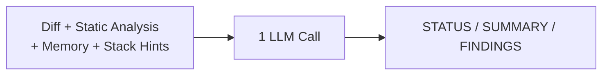
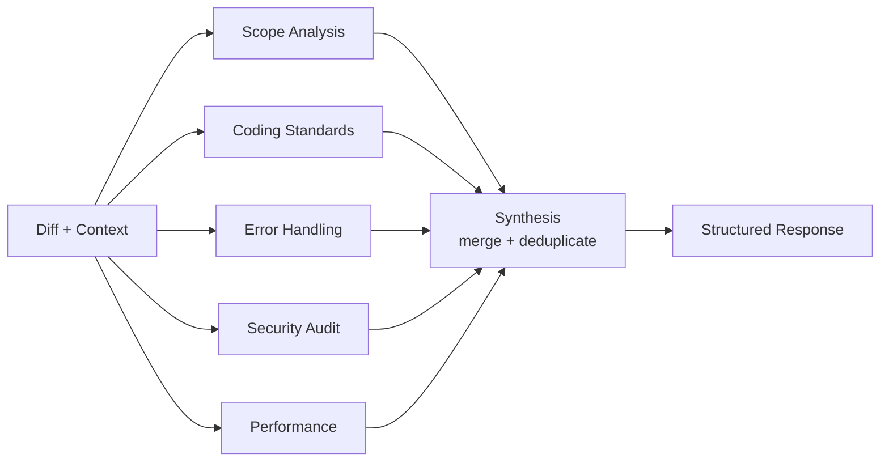
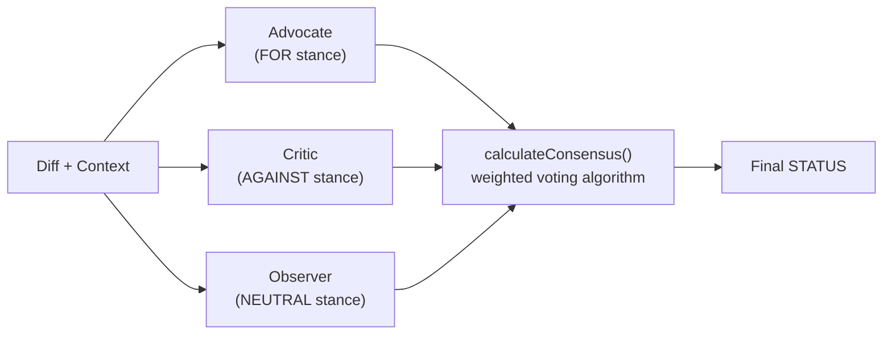

# Review Modes

GHAGGA supports three review modes, each with different tradeoffs between speed, cost, and thoroughness.

## Simple Mode

Single LLM call with a comprehensive system prompt. Best for small-to-medium PRs.

**Token usage**: ~1x (one call)
**Best for**: Quick reviews, small PRs, low token budget

The simple agent receives all context in a single prompt and returns a structured review with status, summary, and findings.

## Workflow Mode

5 specialist agents run **in parallel**, then a synthesis step merges their findings.

**Token usage**: ~6x (5 specialists + 1 synthesis)
**Best for**: Thorough reviews, large PRs, when you want focused analysis per area

Each specialist has a focused system prompt that constrains its analysis to a specific domain. The synthesis agent merges all findings, removes duplicates, and produces the final structured review.

### Specialist Focus Areas

| Specialist | What It Looks For |
|------------|-------------------|
| **Scope Analysis** | Change blast radius, coupling between modified files, missing related changes |
| **Coding Standards** | Naming conventions, DRY violations, code organization, readability |
| **Error Handling** | Null/undefined safety, missing try-catch, error propagation, edge cases |
| **Security Audit** | Injection vectors, XSS, auth bypasses, data exposure, secrets |
| **Performance** | O(n²) loops, N+1 queries, memory leaks, unnecessary re-renders, resource exhaustion |

## Consensus Mode

The same model runs **3 times in parallel** with different system prompts (stances), then a pure algorithmic function computes the final decision -- no additional LLM call.

The three stances are:
- **Advocate (FOR)**: "Argue in favor of approving this change"
- **Critic (AGAINST)**: "Argue against approving this change"
- **Observer (NEUTRAL)**: "Provide balanced analysis of this change"

**Token usage**: ~3x (exactly 3 LLM calls, same model)
**Best for**: Critical code paths, high-confidence decisions, security-sensitive changes

> **Note**: The `ConsensusReviewInput` interface supports specifying different models per stance, but this is not currently exposed in the UI or CLI configuration. All three stances use the same model configured for the review.

### How Voting Works

Each stance returns a decision (`PASSED`, `FAILED`, or `NEEDS_HUMAN_REVIEW`) with a confidence score (0.0 to 1.0). The final status is determined by the `calculateConsensus()` algorithm using weighted voting:

1. Each vote's **weight** equals its confidence score
2. **Abstain** votes (if any) contribute zero weight
3. The algorithm requires **two thresholds** to declare a winner:
   - The gap between the winning side and losing side must be **>= 30%** of total weight
   - The winning side must hold **>= 60%** of total weight
4. If both thresholds are met, the winning decision is the final status
5. If either threshold is not met, the result is `NEEDS_HUMAN_REVIEW`

### Failure Handling

Consensus uses `Promise.allSettled` for the 3 parallel LLM calls:
- If **1 vote fails**, the remaining 2 still count and are fed to `calculateConsensus()`
- If **all 3 fail**, the result is `NEEDS_HUMAN_REVIEW`

### When to Use Each Mode

| Scenario | Recommended Mode |
|----------|-----------------|
| Small PR (< 200 lines) | Simple |
| Large refactor | Workflow |
| New feature with tests | Simple or Workflow |
| Security-sensitive code | Consensus |
| CI budget is tight | Simple |
| Thorough team review replacement | Workflow |
| Final review before release | Consensus |
