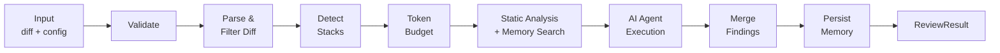
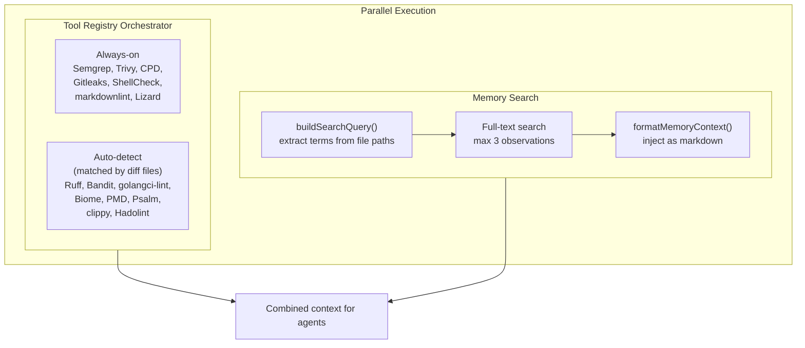

# Review Pipeline

Every review follows the same pipeline regardless of distribution mode. Each step degrades gracefully — if static analysis fails, or memory is unavailable, the pipeline continues with what it has.

## Pipeline Steps



## Step Details

### Step 1: Input Validation

The pipeline validates that all required fields are present:
- Non-empty diff
- Valid API key for the specified provider
- Known provider and model combination

If validation fails, the pipeline returns a `SKIPPED` status with the reason.

### Step 2: Diff Parsing & Filtering

The raw diff is parsed into per-file hunks. Files matching ignore patterns are removed:
- `*.lock` (lock files)
- `*.md` (documentation)
- `*.map` (source maps)
- Custom patterns from `.ghagga.json`

### Step 3: Tech Stack Detection

File extensions are mapped to tech stacks (e.g., `.ts` → TypeScript, `.py` → Python). Detected stacks are injected into agent prompts as hints so the LLM provides language-specific feedback.

### Step 4: Token Budget

The diff is truncated to fit the model's context window. The budget is split 70/30:
- **70%** for the diff content itself
- **30%** for system prompt, static analysis context, memory context, and stack hints

Files are prioritized by modification size — larger changes get reviewed first.

### Step 5: Parallel Analysis

Static analysis and memory search run **in parallel**. The tool registry resolves which tools to run based on tiers (always-on vs auto-detect), file patterns in the diff, and any `enabledTools`/`disabledTools` overrides:



**Memory search details**: `buildSearchQuery()` extracts meaningful terms from file paths in the diff, stripping noise directories (`src/`, `lib/`, `dist/`, `test/`) and extensions, capping at 10 terms. Full-text search retrieves up to 3 past observations. `formatMemoryContext()` formats them as markdown injected into the LLM prompt under `## Past Review Memory`.

### Step 5.5: AI Enhance (Optional)

When `--enhance` is enabled, an AI post-analysis step runs on the static analysis findings before agent execution:

1. **Groups findings by pattern** — clusters related findings across files
2. **Assigns AI priorities** — re-ranks findings based on actual impact, not just tool severity
3. **Suggests fixes** — generates actionable fix suggestions for each finding group
4. **Filters noise** — removes low-signal findings that are likely false positives

This step reduces noise from raw static analysis output and provides more actionable context to the AI agents. It is skipped when `--enhance` is not set.

### Step 6: Agent Execution

The combined context (diff + static findings + memory) is sent to the selected review mode:

- **Simple**: 1 LLM call — fast and cheap
- **Workflow**: 5 specialist agents in parallel + 1 synthesis — thorough
- **Consensus**: 3 stanced reviews (same model) + algorithmic weighted vote — high confidence

See [Review Modes](review-modes.md) for details.

### Step 7: Finding Merge

Static analysis findings are merged into the agent's response. Deduplication ensures the same issue isn't reported twice (once by static analysis and once by the AI).

### Step 8: Memory Persistence

Observations are extracted from the review and stored to the memory database -- PostgreSQL in Server mode, SQLite in CLI and Action modes (fire-and-forget). This step never blocks the response -- if it fails, the review is still returned successfully.

**Persist pipeline**:
1. **Significance filter**: Only **critical**, **high**, and **medium** severity findings are saved
2. **`stripPrivateData()`**: 13 regex patterns redact secrets (API keys, tokens, passwords, PEM keys, JWTs) before storage
3. **Create session**: Scoped to the repository and PR number
4. **Save observations**: Content deduplication via SHA-256 hash (`type:title:content`) with a 15-minute dedup window
5. **Save PR summary**: Topic-key upsert -- re-reviews of the same PR update the existing summary instead of duplicating

See [Memory System](memory-system.md) for full details on backends, search, deduplication, and privacy stripping.

## Trigger Modes

> **Static analysis in SaaS mode**: The server injects `.github/workflows/ghagga.yml` into each target repo and dispatches it via `workflow_dispatch`. If injection is blocked (branch protection, missing permissions), the review proceeds with AI only. See [Architecture — Inline Static-Analysis Workflow](architecture.md#inline-static-analysis-workflow).

Reviews can be triggered in two ways in SaaS mode:

| Trigger | Event | When |
|---------|-------|------|
| **Automatic** | `pull_request` webhook | PR opened, updated (push), or reopened |
| **On-demand** | `issue_comment` webhook | Someone comments `ghagga review` on a PR |

The on-demand trigger uses the same pipeline and settings as automatic reviews. It adds reaction feedback: 👀 when the trigger is received, 🚀 when the review is posted.

**Who can trigger?** Anyone with a contribution relationship to the repository: owners, members, collaborators, contributors, and first-time contributors. Users with no association (`NONE`) or placeholder accounts (`MANNEQUIN`) are rejected.

> **Issues, not just PRs**: a maintainer can also comment `/ghagga triage` on a plain issue to run the [issue-triage agent](issue-triage.md), which drafts an analysis for human approval (it never auto-posts). Triage uses a **stricter** write-association gate (`OWNER` / `MEMBER` / `COLLABORATOR` only) and requires the `Issues: Read and write` App permission.

## Self-Hosted Mode (BullMQ)

In server mode, the pipeline runs via a **BullMQ job queue** backed by Redis. When a webhook receives a PR event, it enqueues a job in the `review` queue. A separate worker process picks up the job and executes the review pipeline. Each review generates a **correlation ID** (`reviewId`) that is propagated through all steps and included in the PR comment for end-to-end tracing.

```typescript
// Webhook handler enqueues the job; worker executes the steps
// All steps carry the reviewId for correlation
Step 1: Fetch PR diff from GitHub API
Step 2: Inject .github/workflows/ghagga.yml into the target repo (idempotent)
Step 3: Dispatch the inline workflow + wait for HMAC callback (or skip if injection is blocked)
Step 4: Memory Search (Layer 1)
Step 5: AI Review (Layer 2)
Step 6: Save Memory (Layer 3)
Step 7: Post PR Comment + React to trigger
```

All GitHub API calls use **HTTP timeouts** (`AbortSignal.timeout()`) to prevent resource exhaustion: 10s for standard API calls, 15s for diff fetching, 5s for keepalive pings.

BullMQ provides automatic retries with configurable backoff. If an LLM call fails, the job can be retried without re-running static analysis. If memory search fails, the pipeline continues without it.

## Graceful Degradation

| Component | If Missing/Failed | Pipeline Behavior |
|-----------|-------------------|-------------------|
| Static analysis tools | Not installed | Skipped individually, review continues with available tools |
| Memory (PostgreSQL or SQLite) | No database connection | Skipped, no memory context |
| LLM Provider | API error | Fallback chain attempts next provider |
| Inline workflow injection | Blocked (branch protection, missing perms) | LLM-only review (no static analysis) |
| Redis/BullMQ | Not connected | Sync execution (no queue-based processing) |
