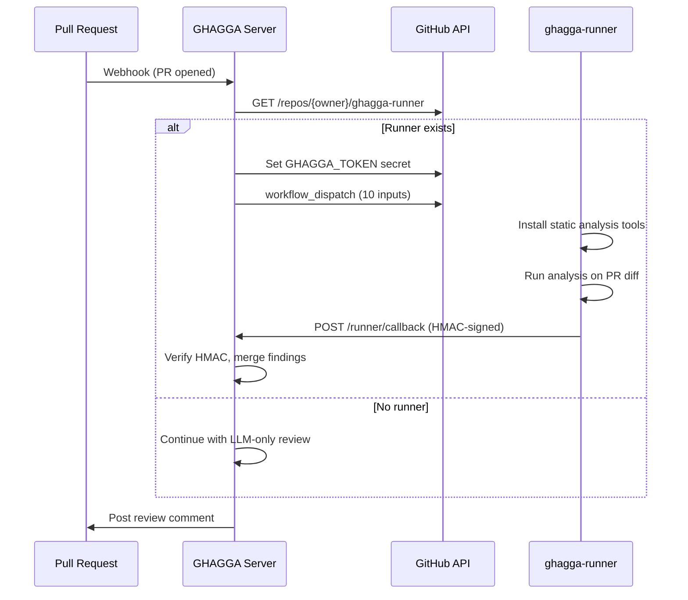
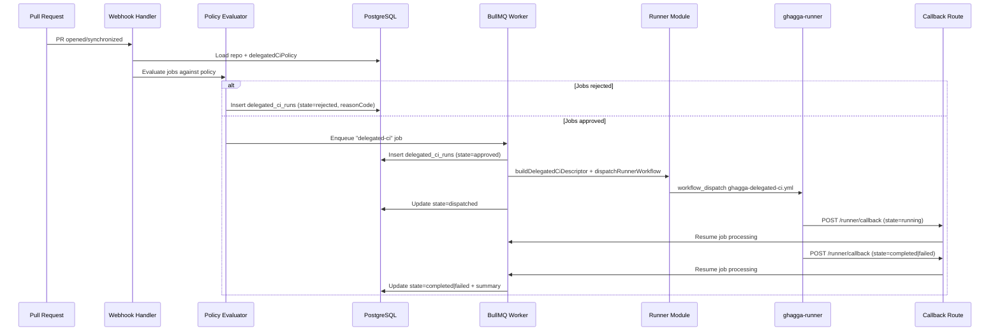
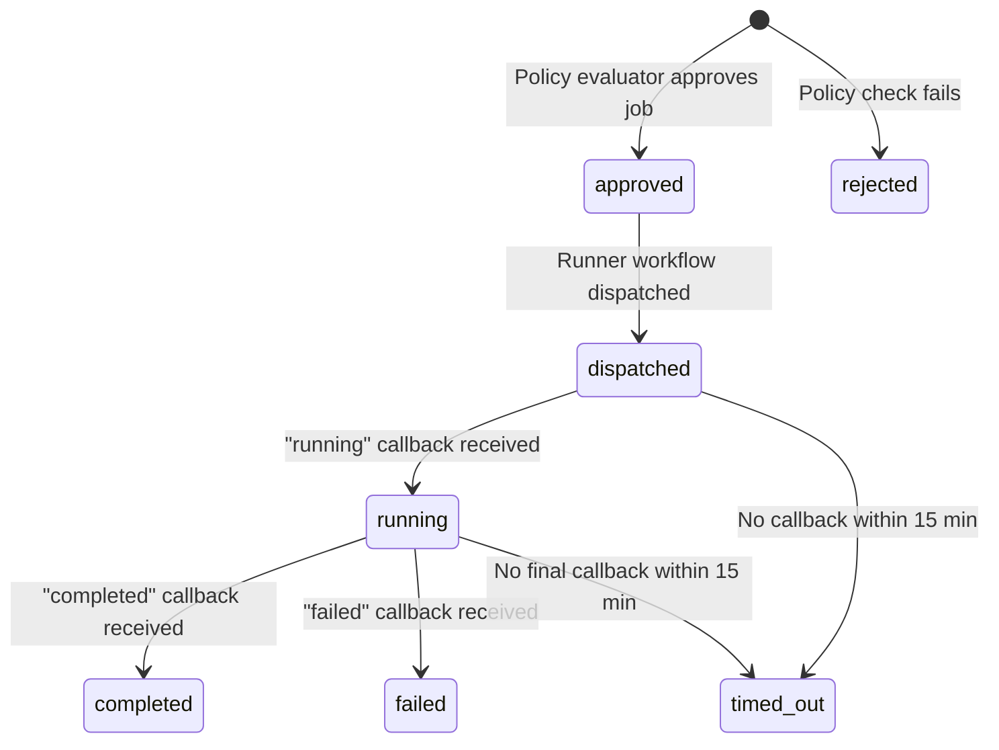

# Runner Architecture

> SaaS mode only. GitHub Action and CLI run static analysis tools directly.

## The Problem

Running Semgrep (Python ~400MB) + PMD/CPD (JVM ~300MB) and the other static analysis tools simultaneously requires significant RAM. On memory-constrained servers, this can be a bottleneck.

## The Solution

GHAGGA delegates static analysis to **user-owned GitHub Actions runners** on public repos:

- **Unlimited free minutes** for public repos
- **7GB RAM** and 2 CPUs per runner
- **No cost** — uses GitHub's free compute

## How It Works

### Setup

**SaaS Dashboard (recommended)**:
1. [Open the Dashboard](https://jnzader.github.io/ghagga/app/) → **Global Settings**
2. Click **"Enable Runner"** — this auto-creates a public `ghagga-runner` repo from the template using the GitHub Template API
3. The server auto-discovers and uses it

**Manual (self-hosted or advanced)**:
1. Create a public repo from [`JNZader/ghagga-runner-template`](https://github.com/JNZader/ghagga-runner-template)
2. Name it `ghagga-runner` (convention-based discovery)
3. That's it — the server auto-discovers and uses it

### Flow



### Dispatch Inputs

The `workflow_dispatch` event carries exactly 10 string inputs (GitHub's maximum):

| Input | Description |
|-------|-------------|
| `callbackId` | Unique ID for this dispatch (UUID) |
| `repoFullName` | Repository being reviewed (`owner/repo`) |
| `prNumber` | Pull request number |
| `headSha` | Head commit SHA of the PR |
| `baseBranch` | Base branch (e.g., `main`) |
| `callbackUrl` | Server URL for results delivery |
| `callbackSecret` | Per-dispatch HMAC secret |
| `enabledTools` | Comma-separated list of tools to force-enable |
| `disabledTools` | Comma-separated list of tools to force-disable |
| `toolRegistryEnabled` | Always `"true"` since v2.4.2 (`GHAGGA_TOOL_REGISTRY` feature flag removed). Kept for backward compatibility with older runner templates |

### Callback

The runner POSTs results to `POST /runner/callback` with:

- **Body**: JSON with `callbackId`, findings array, tool versions, timing
- **Header**: `X-Runner-Signature` — HMAC-SHA256 of the body using the per-dispatch secret
- **Verification**: Server checks the signature against the stored secret (in-memory Map, 11-min TTL)

## Security Model

Private repo code analyzed via a public runner is protected by **4 security layers**:

| Layer | Protection | How |
|-------|-----------|-----|
| **Output suppression** | Tool output hidden | All stdout/stderr redirected to `/dev/null` |
| **Log masking** | Values masked in logs | `::add-mask::` applied to all sensitive values |
| **Log deletion** | Logs removed after use | Workflow run logs deleted via GitHub API |
| **Retention policy** | Short-lived logs | Runner repo configured with 1-day log retention |

### HMAC Per-Dispatch Secret

Each dispatch generates a unique `callbackSecret`:

1. Server generates a random secret
2. Secret is set as a GitHub repository secret (`GHAGGA_TOKEN`) on the runner repo
3. Secret is stored in an in-memory Map with 11-minute TTL
4. Runner signs the callback body with HMAC-SHA256 using this secret
5. Server verifies the signature and deletes the secret from the Map

This ensures only the legitimate runner can deliver results, and secrets auto-expire if the callback never arrives.

## Graceful Fallback

If the runner repo doesn't exist or the dispatch fails, the server falls back to **LLM-only review**:

- Static analysis is skipped entirely (no tool findings)
- The AI review still runs with diff + memory context
- The review comment notes that static analysis was unavailable

## Server Implementation

| File | Purpose |
|------|---------|
| `apps/server/src/github/runner.ts` | Runner discovery, secret setup, workflow dispatch |
| `apps/server/src/routes/runner-callback.ts` | Callback endpoint, HMAC verification |
| `apps/server/src/queues/review.ts` | BullMQ review queue with runner dispatch/wait |
| `templates/ghagga-analysis.yml` | The workflow that runs on the runner |

## Template Repository

The [`ghagga-runner-template`](https://github.com/JNZader/ghagga-runner-template) contains:

- `.github/workflows/ghagga-analysis.yml` — The static analysis workflow (348 lines)
- `.github/workflows/ghagga-delegated-ci.yml` — The delegated CI workflow (407 lines)
- `README.md` — Setup instructions for users
- Workflow auto-installs and caches tools using `@actions/cache`
- First run: ~3-5 minutes (tool installation)
- Subsequent runs: ~18 seconds (cached)

---

## Delegated CI

> Extends the static analysis runner pattern to execute general CI jobs (lint, test) for private repositories on the public runner repo.

Delegated CI is a separate execution kind that reuses the same runner infrastructure (repo discovery, secret provisioning, HMAC callbacks) but has its own policy model, workflow template, orchestration flow, and result storage.

### How It Extends the Runner Pattern

The static analysis runner was built for a single purpose: run GHAGGA-owned analysis tools on PR diffs. Delegated CI generalizes this into a multi-purpose execution platform by separating three concerns:

| Concern | Static Analysis | Delegated CI |
|---------|----------------|--------------|
| **Infrastructure** | Shared: runner discovery, secret provisioning, HMAC callbacks, log deletion |  |
| **Execution** | `ghagga-analysis.yml` with fixed tool set | `ghagga-delegated-ci.yml` with curated profiles |
| **Policy** | Implicit (enabled when runner exists) | Explicit per-repo opt-in with job classification |

The refactored dispatch uses a generic `RunnerWorkflowDescriptor` interface so the runner module no longer knows what execution kind it is dispatching:

```ts
interface RunnerWorkflowDescriptor {
  kind: 'static-analysis' | 'delegated-ci';
  workflowFile: string;
  inputs: Record<string, string>;
}
```

Each execution kind has its own factory function (`buildDelegatedCiDescriptor` for CI, the existing `dispatchWorkflow` for static analysis) that populates the descriptor inputs.

### Dispatch Flow



The dispatch packs CI-specific parameters into a single JSON `config` input alongside 6 explicit `workflow_dispatch` inputs (7 total, within GitHub's ~10 input limit):

| Input | Type | Purpose |
|-------|------|---------|
| `callbackId` | Explicit | Correlation ID (UUID + timestamp) |
| `callbackUrl` | Explicit | Server endpoint for results |
| `callbackSecret` | Explicit | Per-dispatch HMAC secret |
| `repoFullName` | Explicit | Target repository (`owner/repo`) |
| `headSha` | Explicit | Commit to checkout |
| `baseBranch` | Explicit | Base branch for context |
| `config` | JSON | `{ jobKey, profile, allowArtifacts, allowCache, maxDurationMinutes, prNumber }` |

### Execution Profiles

Delegated CI runs only GHAGGA-curated execution profiles. Arbitrary repo workflows and shell commands are not supported in MVP.

| Profile | Runtime | Command | Default Timeout | Max Timeout | Allowed Artifacts |
|---------|---------|---------|-----------------|-------------|-------------------|
| `node-lint` | Node.js 20 | `npm run lint` | 5 min | 10 min | `junit` |
| `node-unit` | Node.js 20 | `npm test` | 10 min | 30 min | `junit`, `coverage-summary` |
| `python-lint` | Python 3.12 | `ruff check .` | 5 min | 10 min | `junit` |
| `python-pytest` | Python 3.12 | `pytest` | 10 min | 30 min | `junit`, `coverage-summary` |
| `go-test` | Go 1.22 | `go test ./...` | 10 min | 30 min | `junit`, `coverage-summary` |

All profiles have `requiresSecrets: false` as a hard safety boundary. A profile that would need secrets is by definition `sensitive/no-delegable`.

### Policy Model

Delegated CI is controlled by a per-repository policy stored as a JSONB column (`delegatedCiPolicy`) on the `repositories` table. The policy is repo-scoped only and is never inherited from installation-level settings.

```ts
interface DelegatedCiPolicy {
  enabled: boolean;              // Global kill switch
  allowManualTrigger?: boolean;  // Dashboard/API triggers
  allowPullRequestTrigger?: boolean;
  jobs: DelegatedCiJobPolicy[];  // Per-job configuration
}
```

Each job is classified as either `safe/delegable` or `sensitive/no-delegable`. The policy evaluator applies checks in strict order (first failure wins):

1. Policy exists and is enabled
2. Job exists in the policy
3. Job is enabled (per-job opt-out)
4. Job classification is `safe/delegable`
5. Profile is supported in the MVP registry
6. Duration does not exceed profile maximum
7. Artifact kinds are valid for the profile

Any job that fails a check is rejected with a machine-readable `reasonCode` (e.g., `delegated_ci_disabled`, `job_sensitive`, `profile_unsupported`).

### BullMQ Orchestration Lifecycle

Delegated CI uses a dedicated BullMQ queue (`delegated-ci`) separate from the AI review queue. The lifecycle for each approved job:



The worker processes approved jobs sequentially within a single job execution. Each job follows 4 steps:

1. **Create run record** -- inserts a `delegated_ci_runs` row with `state: approved`
2. **Dispatch** -- builds the descriptor, provisions ephemeral secrets, dispatches `ghagga-delegated-ci.yml`, updates state to `dispatched`
3. **Wait for callback** -- polls for the runner callback with a 15-minute timeout
4. **Finalize** -- updates the run record to `completed`, `failed`, or `timed_out`

### Callback Routing

The callback endpoint (`POST /runner/callback`) is dual-purpose: it handles both static analysis and delegated CI callbacks through a single route, disambiguated by the `executionKind` field in the payload.

| Payload Field | Static Analysis | Delegated CI |
|--------------|-----------------|--------------|
| `executionKind` | Absent / undefined | `"delegated-ci"` |
| Queue notified | `review` queue | `delegated-ci` queue |
| Resuming job | Review worker job | Delegated CI worker job |

Both callback types share the same HMAC verification logic (`verifyCallbackSignature`) and the same `POST /runner/callback` route. The callback router parses the payload, determines the execution kind, and notifies the appropriate BullMQ job so the correct worker resumes processing.

### Delegated CI Security Considerations

See [Security -- Delegated CI Safety Boundaries](security.md#delegated-ci-safety-boundaries) for the full security model. Key points:

- **Code never stored**: The runner clones the private repo, executes the CI profile, then deletes the workspace. No code persists on the runner.
- **Logs suppressed**: All tool stdout/stderr is redirected to temp files, never printed to workflow logs. Logs are deleted after each run.
- **Encrypted config transport**: The `config` JSON input is transmitted via `workflow_dispatch` (GitHub's encrypted channel). The `callbackSecret` is set as a GitHub Actions secret.
- **Profile-based restriction**: Only GHAGGA-curated profiles run — no arbitrary shell commands, no repo-authored workflows.
- **No secrets fan-out**: Delegated CI jobs receive only the ephemeral `GHAGGA_TOKEN` (installation token) and `GHAGGA_CALLBACK_SECRET`. No repo/environment secrets are copied to the runner.

### Run State Persistence

Delegated CI runs are stored in a dedicated `delegated_ci_runs` table, separate from the `reviews` table. Each row tracks:

- Repository and PR context
- Job key and execution profile
- State transitions (`approved` -> `dispatched` -> `running` -> `completed`/`failed`/`timed_out`)
- Rejection reason codes and details (for policy-rejected jobs)
- Callback correlation ID
- Timing data and result summary

### Server Implementation

| File | Purpose |
|------|---------|
| `apps/server/src/delegated-ci/profiles.ts` | Curated execution profile registry |
| `apps/server/src/delegated-ci/policy.ts` | Policy evaluator with classification and MVP guardrails |
| `apps/server/src/github/runner.ts` | Runner discovery, secret provisioning, generic workflow dispatch |
| `apps/server/src/queues/delegated-ci.ts` | BullMQ orchestration (create, dispatch, wait, finalize) |
| `apps/server/src/routes/runner-callback.ts` | Dual-purpose callback route (static analysis + delegated CI) |
| `templates/ghagga-delegated-ci.yml` | Runner workflow template for CI jobs |
| `packages/db/src/schema.ts` | `delegated_ci_runs` table and `delegatedCiPolicy` JSONB column |
