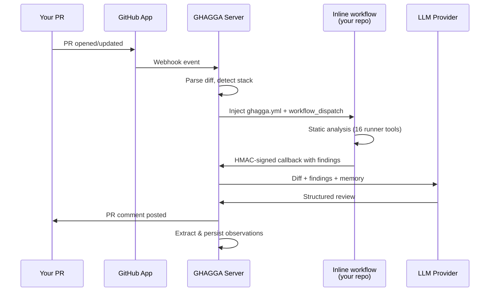

# Getting Started with GHAGGA (SaaS / GitHub App)

Go from zero to your first AI code review in under 5 minutes. This guide walks you through installing the GHAGGA GitHub App, configuring your LLM provider in the [Dashboard](https://ghagga.javierzader.com/app/), and getting your first review on a Pull Request.

## Prerequisites

- A **GitHub account**
- A repository (public or private) with at least one open Pull Request — or the ability to create one
- A modern web browser (for the Dashboard)

> **Not looking for SaaS?** If you need CI/CD integration, try the [GitHub Action](github-action.md). For local terminal reviews, see the [CLI](cli.md). For full self-hosted control, see the [Self-Hosted Guide](self-hosted.md).

---

## Step 1: Install the GitHub App

**[Install the GHAGGA GitHub App](https://github.com/apps/ghagga-review/installations/new)**

1. Click the link above — it opens the GitHub App installation page
2. Choose which repositories GHAGGA should have access to:
   - **All repositories** — GHAGGA reviews PRs on every repo in your account
   - **Only select repositories** — pick specific repos
3. Click **"Install"**

### What permissions does the App request?

| Permission | Access | Why |
|-----------|--------|-----|
| **Pull requests** | Read and write | Fetch PR diffs and post review comments |
| **Contents** | Read and write | Inject the static-analysis workflow at `.github/workflows/ghagga.yml` |
| **Actions** | Write | Dispatch the injected workflow via `workflow_dispatch` |
| **Issues** | Read and write | Issue-triage (`/ghagga triage`): read the issue + its comments, post the approved draft comment |
| **Metadata** | Read-only | List repositories (auto-selected by GitHub) |

> **Note**: GHAGGA does **not** request the `Secrets` permission. LLM API keys are encrypted with AES-256-GCM and stored inside GHAGGA's own database, not in GitHub repository secrets. The per-dispatch callback secret travels via `workflow_dispatch` inputs, not via repo secrets.

> **Re-consent note**: The `Issues` permission was added for the issue-triage feature. Existing installations must **re-approve** the App's permissions before it keeps working — GitHub prompts admins automatically when a new scope is requested.

> **Important**: After installing the App, reviews will **NOT** work until you configure at least one LLM provider in the [Dashboard](https://ghagga.javierzader.com/app/). Continue to Step 2.

---

## Step 2: Open the Dashboard

**[Open the GHAGGA Dashboard](https://ghagga.javierzader.com/app/)**

1. Click **"Login"** on the Dashboard
2. You'll be redirected to GitHub's **OAuth Web Flow** consent screen
3. Approve the GHAGGA OAuth app
4. GitHub redirects you back to the Dashboard and you are logged in

> **Tip**: The Dashboard uses GitHub Pages, but authentication is completed by the GHAGGA server via OAuth Web Flow. If the server is unavailable, the Dashboard falls back to manual PAT entry.

**Verification**: You should see the Dashboard home page with stats cards (they'll show zeros until your first review).

---

## Step 3: Configure Your LLM Provider

Navigate to **Dashboard** > **Settings** (or **Global Settings** for installation-wide defaults).

### Choose a provider

| Mode | What you configure | API key |
|------|--------------------|---------|
| `gateway` | mcp-llm-bridge URL and the model the bridge should call | Gateway credential |
| `cli-bridge` | A local CLI (Claude, Codex, OpenCode, Gemini, Copilot) | Only if that CLI asks for one |
| `ollama` | A local Ollama model | No |

Dashboard login does not select a model. Add a provider chain before a review calls an LLM. Legacy provider names are normalized to `gateway`.

### Gateway setup

1. In **Settings**, choose `gateway`
2. Set the bridge URL and the model
3. Save the credential

> The dashboard OAuth token is for the dashboard and the GitHub App. It is not a model credential.

### BYOK setup (Bring Your Own Key)

1. In **Settings**, select your preferred provider (e.g., "Anthropic")
2. Paste your API key in the **"API Key"** field
3. Click **"Save"**

> **Security**: API keys are encrypted with **AES-256-GCM** at rest. GHAGGA never stores or logs your keys in plaintext. You can rotate or delete keys at any time from Settings.

**Verification**: The Settings page should show your selected provider with a green status indicator.

---

## Step 4: Static Analysis (Inline Workflow)

Static analysis (Semgrep for security, Trivy for vulnerabilities, CPD for code duplication, plus 13 other auto-detected tools) runs alongside the AI review using an **inline GitHub Actions workflow**.

There is nothing to enable manually — when GHAGGA dispatches a review, it injects `.github/workflows/ghagga.yml` (built from `templates/ghagga-inline.yml`) into the target repository if it doesn't already exist, then triggers a `workflow_dispatch`. The workflow runs in your own repo using your own free GitHub Actions minutes and posts results back to the server via an HMAC-signed callback.

**What you get**:

| Component | Behavior |
|-----------|---------|
| AI review (LLM analysis) | Always runs once a provider is configured |
| Static analysis (16 runner tools) | Runs on every dispatch via the inline workflow |

The inline workflow runs the 16 runner-bundled tools: Semgrep, Trivy, CPD, Gitleaks, ShellCheck, markdownlint, Lizard, Ruff, Bandit, golangci-lint, Biome, PMD, Psalm, clippy, Hadolint, and zizmor. The full plugin registry is 17; SonarQube is MCP-only and stays inert unless an MCP server is configured. Tools are automatically selected based on the detected tech stack in your PR.

The workflow uses **GitHub Actions free minutes** on public repos (unlimited; 7GB RAM per run). First run takes ~3–5 minutes (tool installation); subsequent runs take ~18 seconds (cached). On private repos, runs consume your GitHub Actions quota.

**Verification**: After your first PR review, check `.github/workflows/ghagga.yml` — the file should exist and match the canonical template.

---

## Step 5: Open a PR and Get Your First Review

1. Create a new Pull Request (or push a commit to an existing one) on a repository where you installed the App
2. Wait **~1-2 minutes** for the review to arrive

### What to expect

GHAGGA posts a **review comment** on your PR with:

- **Status**: `PASSED`, `FAILED`, `NEEDS_HUMAN_REVIEW`, or `SKIPPED`
- **Summary**: A brief overview of the changes
- **Findings**: Individual issues with severity (Critical, High, Medium, Low, Info), description, file location, and suggested fix
- **Static analysis results** (if runner is enabled): Security vulnerabilities, known CVEs, duplicated code

> **Tip**: You can re-trigger a review at any time by commenting `ghagga review` on the PR.

**Verification**: You should see a comment from the GHAGGA bot on your Pull Request.

---

## What Just Happened?

Here's what GHAGGA did when you opened that PR:

1. GitHub sends a **webhook** to the GHAGGA server when your PR is opened or updated.
2. The server **parses the diff**, detects the tech stack, and checks your token budget.
3. The server **injects** `.github/workflows/ghagga.yml` into your repo (if not present) and **dispatches** the inline workflow (16 runner-bundled tools; SonarQube is MCP-only).
4. The inline workflow runs, signs its results with the per-dispatch HMAC secret, and POSTs to `/runner/callback`.
5. The server sends the diff + static findings + project memory to your configured **LLM provider**.
6. The LLM returns a structured review, which is **posted as a PR comment**.
7. Observations from the review are **extracted and stored** in project memory for future reviews.

---

## What Happens Without Configuration

| State | What you get |
|-------|-------------|
| App installed, **no LLM provider configured** | No review comment posted — the server has no AI provider to analyze the diff |
| App installed, **LLM configured, inline workflow blocked** | AI-only review — branch protection or missing `Contents: write` prevents workflow injection; review still runs without static analysis |
| App installed, **LLM configured, normal setup** | Full review — static analysis findings + AI review + project memory |

---

## Troubleshooting

### No review comment posted

1. **Check your provider chain**: Dashboard → Settings. You need a `gateway`, `cli-bridge`, or `ollama` entry. Dashboard login is not a model credential.
2. **Check the App is installed on that repo**: Go to your GitHub Settings > Applications > GHAGGA > Configure — make sure the repo is in the list
3. **Check the PR is on the right event type**: GHAGGA triggers on `opened`, `synchronize`, and `reopened` events. Draft PRs may not trigger reviews depending on your config.

### Review comment is empty or minimal

- **Enable the runner** for static analysis findings — without it, the review relies entirely on the LLM
- **Check your review mode**: Try `workflow` mode (5 specialist agents) in Settings for more thorough reviews
- **Small diffs may produce minimal reviews** — this is expected for trivial changes

### Static analysis didn't run

- Verify the GitHub App has **Contents: Read and write** and **Actions: Write** on the target repo — both are required to inject `.github/workflows/ghagga.yml` and dispatch it.
- Branch protection rules on the default branch can block the workflow injection. Add an exception for the `github-actions[bot]` user or pre-commit the workflow file yourself.
- Check the GitHub App webhook deliveries (Advanced → Recent Deliveries) for non-200 responses indicating dispatch failures.
- If the workflow file is present but never runs, confirm Actions is enabled for the repository (Settings → Actions → General).

---

## Cost Summary

| Component | Cost |
|-----------|------|
| **GHAGGA** | Free and open source (MIT license) |
| **Hosted SaaS** | Free to use |
| **gateway / cli-bridge** | You pay whoever serves that model |
| **Ollama** | Local. No API key |
| **Static analysis** (Semgrep, Trivy, CPD) | Free — runs on GitHub Actions runners (unlimited free minutes for public repos) |

---

## Next Steps

- **[Review Modes](review-modes.md)** — Learn about Simple, Workflow, and Consensus modes
- **[Memory System](memory-system.md)** — How GHAGGA learns from past reviews
- **[Configuration](configuration.md)** — Environment variables and config file options
- **[Static Analysis](static-analysis.md)** — Semgrep rules, Trivy scanning, CPD detection
