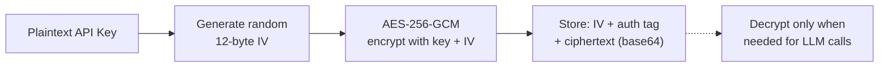

# Security

> Canonical security policy: see the root [`SECURITY.md`](../SECURITY.md). This docs page mirrors the current architecture-specific details.

## Security Measures

| Measure | Implementation |
|---------|---------------|
| **API key encryption** | AES-256-GCM with per-installation encryption keys. Keys are never stored in plaintext. |
| **Webhook verification** | HMAC-SHA256 signature verification with `crypto.timingSafeEqual` (constant-time comparison to prevent timing attacks) |
| **JWT generation** | RS256 manual JWT construction for GitHub App installation tokens |
| **Privacy stripping** | 13 regex patterns remove secrets before storing to memory |
| **No secret logging** | Console outputs and error messages never contain sensitive data |
| **BYOK model** | Users provide their own LLM API keys. GHAGGA never pays for or sees your LLM usage in plaintext. |
| **Installation scoping** | API routes are scoped by GitHub installation ID — users can only access their own repos |
| **Runner HMAC** | Per-dispatch HMAC-SHA256 verification for runner callbacks. Secret derived deterministically from `STATE_SECRET + callbackId` with an 11-minute default TTL (configurable via `CALLBACK_TTL_MINUTES`). |
| **OAuth separation** | Dashboard uses GitHub OAuth Web Flow with `STATE_SECRET` + `GITHUB_CLIENT_SECRET`; CLI uses GitHub Device Flow; PAT fallback remains available when the server is unavailable. |
| **HTTP timeouts** | All `fetch()` calls use `AbortSignal.timeout()` (10s for API calls, 15s for diff fetching, 5s for keepalive) to prevent resource exhaustion |
| **Env validation (fail-fast)** | Server validates all required environment variables at startup, exiting immediately with a clear error if any are missing |
| **Error IDs** | All 500 responses include an `errorId` (8-char UUID) for support ticket correlation with server logs |
| **Correlation IDs** | Each review generates a `reviewId` propagated through webhook -> BullMQ -> pipeline -> PR comment for end-to-end tracing |
| **FK cascade delete** | All foreign keys use `ON DELETE CASCADE` to prevent orphaned data when installations are removed |
| **Idempotent migrations** | All SQL migrations use `IF NOT EXISTS` guards for safe re-execution |

## AES-256-GCM Encryption

API keys provided by users are encrypted at rest using AES-256-GCM:

- **256-bit key** derived from the `ENCRYPTION_KEY` environment variable (64 hex characters)
- **Unique IV** generated for each encryption operation (12 bytes)
- **Authentication tag** prevents tampering — decryption fails if ciphertext is modified
- **No external dependencies** — uses Node.js built-in `crypto` module

## Webhook Verification

GitHub webhook signatures are verified using HMAC-SHA256:

1. Compute `HMAC-SHA256(webhook_secret, request_body)`
2. Compare with the `X-Hub-Signature-256` header
3. Use `crypto.timingSafeEqual` for constant-time comparison (prevents timing attacks)

Invalid signatures are rejected with HTTP 401.

## Privacy Stripping

See [Memory System -- Privacy Stripping](memory-system.md#privacy-stripping) for the full list of 13 patterns that are stripped before storing observations.

## Automated Security Tests

The test suite includes dedicated security audit tests that verify:

- No `console.log` calls with sensitive variable names across the entire codebase
- No hardcoded API keys, tokens, or passwords in source files
- No use of `eval()` or `Function()` constructors
- AES-256-GCM encryption roundtrip correctness
- Tampered ciphertext detection
- `timingSafeEqual` usage for webhook signature comparison
- Privacy stripping covers all 13 secret patterns

## Inline Runner Security Model

GHAGGA's static-analysis runner is an **inline GitHub Actions workflow** that the server injects into each target repository at `.github/workflows/ghagga.yml` (built from `templates/ghagga-inline.yml`). The workflow is dispatched via `workflow_dispatch` on the target repo itself — there is no separate runner repository, no installation-token fan-out, and no `secrets:write` requirement.

### Callback Authentication

Each `workflow_dispatch` carries a per-dispatch callback secret:

1. The server generates a `callbackId` in the format `{uuid}.{timestamp_base36}`.
2. The server derives the callback secret deterministically: `callbackSecret = HMAC-SHA256(STATE_SECRET, callbackId)`.
3. The secret is sent to the workflow via the `callbackSecret` `workflow_dispatch` input (encrypted in transit by the GitHub Actions API).
4. Inside the workflow, the value is masked with `::add-mask::` before any step that could log it.
5. The runner signs the response body with `HMAC-SHA256(callbackSecret, body)` and POSTs to `/runner/callback` with header `X-Ghagga-Signature: sha256=<hex>`.
6. The server re-derives the secret from `STATE_SECRET + callbackId`, verifies the HMAC with `crypto.timingSafeEqual`, and rejects callbacks older than the configured TTL (default 11 minutes, configurable via `CALLBACK_TTL_MINUTES`).

This stateless model survives server restarts, container redeploys, and horizontal scaling — any instance sharing the same `STATE_SECRET` can verify any callback.

### Output Hardening Inside the Workflow

The inline workflow follows the same output-discipline rules that protected the previous out-of-repo runner pattern:

| Layer | What it does | How |
|-------|--------------|-----|
| **Sensitive value masking** | `::add-mask::` is applied to `callbackSecret` and `callbackUrl` before any other step runs | First step of the `analyze` job in `templates/ghagga-inline.yml` |
| **Generic error messages** | Tool failures collapse to short strings like `"<tool>: execution failed"` or `"<tool>: parse failed"` — never raw stderr | Each tool's run step writes a normalized `*-result.json` and discards stderr |
| **Bounded permissions** | The workflow declares `permissions: contents: read` only | No `pull-requests`, no `actions`, no `secrets` |
| **Per-callback secret** | Each dispatch uses a fresh derived secret with a short TTL | See "Callback Authentication" above |

Logs are visible to the repository owner (the workflow runs in their repo), so there is no privacy boundary between GHAGGA and the repo owner — but the workflow still avoids dumping raw tool output that could echo unrelated repository content or accidentally print the callback secret.

## Security Best Practices

1. **Never commit API keys** — Use environment variables or GitHub secrets.
2. **Generate a strong ENCRYPTION_KEY** — Use `openssl rand -hex 32` to generate 64 hex characters.
3. **Rotate webhook secrets** — If compromised, regenerate in GitHub App settings.
4. **Use HTTPS** — All webhook endpoints should be served over HTTPS.
5. **Limit GitHub App permissions** — Only request `pull_requests: write`, `actions: write`, and `metadata: read` (auto). `Contents: Write` is needed to inject the inline workflow file into the target repo at `.github/workflows/ghagga.yml`. The `administration` permission is not needed. `Secrets: Read & Write` is **not** required — GHAGGA no longer fans out repository secrets to a separate runner repo.
6. **Use the correct auth flow** — Dashboard uses OAuth Web Flow, so self-hosted/server deployments need `GITHUB_CLIENT_SECRET` and `STATE_SECRET`. CLI uses Device Flow via `ghagga login`. Never store GitHub tokens in config files.
7. **Treat the workflow file as a trust boundary** — `templates/ghagga-inline.yml` is the only workflow GHAGGA writes into a target repository. Repository owners can audit it on every dispatch; reject any changes that don't originate from the official template.
