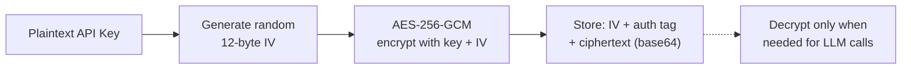
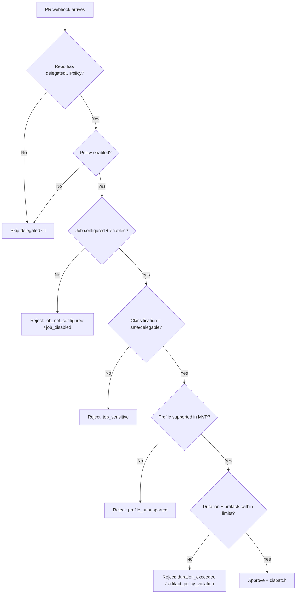

# Security

> Canonical security policy: see the root [`SECURITY.md`](../SECURITY.md). This docs page mirrors the current architecture-specific details.

## Security Measures

| Measure | Implementation |
|---------|---------------|
| **API key encryption** | AES-256-GCM with per-installation encryption keys. Keys are never stored in plaintext. |
| **Webhook verification** | HMAC-SHA256 signature verification with `crypto.timingSafeEqual` (constant-time comparison to prevent timing attacks) |
| **JWT generation** | RS256 manual JWT construction for GitHub App installation tokens |
| **Privacy stripping** | 16 regex patterns remove secrets before storing to memory |
| **No secret logging** | Console outputs and error messages never contain sensitive data |
| **BYOK model** | Users provide their own LLM API keys. GHAGGA never pays for or sees your LLM usage in plaintext. |
| **Installation scoping** | API routes are scoped by GitHub installation ID — users can only access their own repos |
| **Runner HMAC** | Per-dispatch HMAC-SHA256 verification for runner callbacks. Unique secret per dispatch with 11-minute TTL. |
| **OAuth separation** | Dashboard uses GitHub OAuth Web Flow with `STATE_SECRET` + `GITHUB_CLIENT_SECRET`; CLI uses GitHub Device Flow; PAT fallback remains available when the server is unavailable. |
| **HTTP timeouts** | All `fetch()` calls use `AbortSignal.timeout()` (10s for API calls, 15s for diff fetching, 5s for keepalive) to prevent resource exhaustion |
| **Env validation (fail-fast)** | Server validates all required environment variables at startup, exiting immediately with a clear error if any are missing |
| **Error IDs** | All 500 responses include an `errorId` (8-char UUID) for support ticket correlation with server logs |
| **Correlation IDs** | Each review generates a `reviewId` propagated through webhook -> BullMQ -> pipeline -> PR comment for end-to-end tracing |
| **FK cascade delete** | All foreign keys use `ON DELETE CASCADE` to prevent orphaned data when installations are removed |
| **Idempotent migrations** | All SQL migrations use `IF NOT EXISTS` guards for safe re-execution |

## AES-256-GCM Encryption

API keys provided by users are encrypted at rest using AES-256-GCM:

- **256-bit key** derived from the `ENCRYPTION_KEY` environment variable (64 hex characters)
- **Unique IV** generated for each encryption operation (12 bytes)
- **Authentication tag** prevents tampering — decryption fails if ciphertext is modified
- **No external dependencies** — uses Node.js built-in `crypto` module

## Webhook Verification

GitHub webhook signatures are verified using HMAC-SHA256:

1. Compute `HMAC-SHA256(webhook_secret, request_body)`
2. Compare with the `X-Hub-Signature-256` header
3. Use `crypto.timingSafeEqual` for constant-time comparison (prevents timing attacks)

Invalid signatures are rejected with HTTP 401.

## Privacy Stripping

See [Memory System — Privacy Stripping](memory-system.md) for the full list of 16 patterns that are stripped before storing observations.

## Automated Security Tests

The test suite includes 14 dedicated security audit tests that verify:

- No `console.log` calls with sensitive variable names across the entire codebase
- No hardcoded API keys, tokens, or passwords in source files
- No use of `eval()` or `Function()` constructors
- AES-256-GCM encryption roundtrip correctness
- Tampered ciphertext detection
- `timingSafeEqual` usage for webhook signature comparison
- Privacy stripping covers all 16 secret patterns

## Runner Security Model

When the GHAGGA server delegates static analysis to a user-owned GitHub Actions runner, private repository code is exposed on a public runner. Four security layers protect against code leakage:

### Layer 1: Output Suppression

All static analysis tool output is redirected to `/dev/null` in the runner workflow. No code snippets, file paths, or analysis results appear in the GitHub Actions workflow logs.

### Layer 2: Log Masking

Sensitive values are masked using GitHub Actions' `::add-mask::` command. Even if a value accidentally appears in a log line, it's replaced with `***`.

### Layer 3: Log Deletion

After the analysis completes and results are delivered via callback, the runner workflow deletes its own run logs using the GitHub API. This removes any residual data from GitHub's log storage.

### Layer 4: Retention Policy

The runner repository is configured with a 1-day log retention policy. Even if log deletion fails, logs are automatically purged within 24 hours.

### Per-Dispatch HMAC Verification

Each `workflow_dispatch` generates a unique callback secret:

1. Server generates a random secret and stores it in an in-memory Map (11-minute TTL)
2. Secret is set as a GitHub repository secret (`GHAGGA_TOKEN`) on the runner repo
3. Runner signs the callback body with `HMAC-SHA256(secret, body)`
4. Server verifies the `X-Runner-Signature` header against the stored secret
5. Secret is deleted from the Map after successful verification

This prevents:
- **Replay attacks**: Each secret is single-use and expires in 11 minutes
- **Spoofed callbacks**: Only the runner with access to `GHAGGA_TOKEN` can generate valid signatures
- **Stale secrets**: In-memory Map entries auto-expire, preventing memory leaks

## Delegated CI Safety Boundaries

Delegated CI extends the runner pattern to execute general CI jobs (lint, tests) for private repositories on the public runner. This introduces a broader attack surface than static analysis because CI profiles execute project code (running `npm test` or `pytest` evaluates user-authored test files). The following guardrails constrain that risk.

### Private Repo Code on the Public Runner

The `ghagga-delegated-ci.yml` workflow clones the private repository using an ephemeral GitHub installation token, executes the CI profile, and destroys the workspace:

1. **Clone** -- `actions/checkout@v4` clones the target repo at the specific `headSha` into a `target-repo/` directory
2. **Execute** -- The curated profile command runs with all stdout/stderr redirected to temp files (`/tmp/ci-stdout.txt`, `/tmp/ci-stderr.txt`) -- never printed to logs
3. **Cleanup** -- The `Cleanup` step runs unconditionally (`if: always()`) and removes `target-repo/` and all temp files via `rm -rf`
4. **Log deletion** -- The workflow deletes its own run logs via the GitHub API after the callback is sent

No source code, test output, or workspace artifacts persist on the runner after the workflow completes.

### Log Scrubbing and Secret Masking

The workflow applies `::add-mask::` to all sensitive values before any step that could produce output:

| Value Masked | Reason |
|-------------|--------|
| `GHAGGA_TOKEN` | Installation token for private repo access |
| `repoFullName` | Prevents repo name from appearing in logs |
| Repo name (after `/`) | Catches partial references |
| `callbackSecret` | HMAC signing key |
| Working directory path | Prevents filesystem path exposure |

Even if a masked value accidentally appears in a log line, GitHub replaces it with `***`. As a defense-in-depth measure:

- All CI tool output is captured to files (`> /tmp/ci-stdout.txt 2> /tmp/ci-stderr.txt`), never echoed
- Only a short summary (first 5 lines, max 500 chars of stdout) is included in the callback payload
- Workflow logs are proactively deleted after callback delivery
- The runner repo has a 1-day log retention policy as a safety net

### Encrypted Configuration Transport

Delegated CI dispatch inputs travel through two encrypted channels:

1. **GitHub Actions secrets** -- `GHAGGA_TOKEN` and `GHAGGA_CALLBACK_SECRET` are set as encrypted repository secrets on the runner repo using libsodium sealed-box encryption (GitHub's standard mechanism). The server fetches the repo's public key, encrypts the secret value, and PUTs it via the API.

2. **workflow_dispatch inputs** -- The `config` JSON and other dispatch inputs are transmitted via the GitHub Actions `workflow_dispatch` API, which is TLS-encrypted in transit. Security-critical inputs (`callbackSecret`, `callbackUrl`, `token`) remain as separate workflow inputs so the runner can use them before parsing any JSON.

The callback secret is derived deterministically via `HMAC-SHA256(STATE_SECRET, callbackId)` on the server side, which means the server never stores secrets in memory -- it re-derives them during callback verification. The `callbackId` embeds a base-36 timestamp, and callbacks are rejected if older than the configured TTL (default 11 minutes).

### Policy-Based Access Control

Delegated CI enforces a multi-layer access control model:

Key policy rules:

- **Repo-only scope** -- Delegated CI policy is stored per-repository and is never inherited from installation-level settings. Enabling it for one repo does not affect any other repo.
- **Conservative defaults** -- Any unconfigured, unclassified, or ambiguous job defaults to `sensitive/no-delegable`. The policy normalizer applies safe defaults for all fields.
- **Profile restriction** -- Only GHAGGA-curated execution profiles are allowed. Arbitrary shell commands, repo-authored workflows, and custom scripts cannot be delegated.
- **No secrets fan-out** -- Delegated CI jobs receive only `GHAGGA_TOKEN` (ephemeral installation token) and `GHAGGA_CALLBACK_SECRET`. Repo environment secrets, signing keys, cloud credentials, and long-lived PATs are never copied to the runner.
- **Artifact controls** -- Artifact uploads are disabled by default. When enabled, only allowlisted kinds (`junit`, `coverage-summary`) are accepted. Source bundles and workspace exports are blocked.
- **Rejection audit trail** -- Every rejected job is persisted in `delegated_ci_runs` with a machine-readable `reasonCode` and `reasonDetail`, providing a full audit trail of what was blocked and why.

### What Delegated CI Explicitly Does NOT Support

These are intentional MVP safety boundaries, not missing features:

- Production deployments, release publishing, or package publication
- Jobs requiring signing keys, cloud credentials, or production secrets
- Arbitrary repo-authored workflow files or shell commands
- Cross-repository cache sharing or secret sharing
- Automatic job classification without explicit repository-owner configuration

## Security Best Practices

1. **Never commit API keys** — Use environment variables or GitHub secrets
2. **Generate a strong ENCRYPTION_KEY** — Use `openssl rand -hex 32` to generate 64 hex characters
3. **Rotate webhook secrets** — If compromised, regenerate in GitHub App settings
4. **Use HTTPS** — All webhook endpoints should be served over HTTPS
5. **Limit GitHub App permissions** — Only request `pull_requests: write`, `actions: write`, `secrets: read-write`, and `metadata: read` (auto). The `administration` and `contents` permissions are no longer needed — runner repo creation is handled via the user's OAuth token.
6. **Use the correct auth flow** — Dashboard uses OAuth Web Flow, so self-hosted/server deployments need `GITHUB_CLIENT_SECRET` and `STATE_SECRET`. CLI uses Device Flow via `ghagga login`. Never store GitHub tokens in config files.
7. **Configure runner repo as public** — The `ghagga-runner` repo must be public for free GitHub Actions minutes. Never put sensitive code in this repo — it only contains the analysis workflow.
8. **Review runner workflow changes** — The `ghagga-analysis.yml` and `ghagga-delegated-ci.yml` workflows are the trust boundary. Only accept changes from the template repository.

## OAuth Scope: `public_repo`

The Dashboard requests the `public_repo` OAuth scope during login. This is required to create the `ghagga-runner` repository in the user's GitHub account via the Template Repository API.

**Why `public_repo`?** GitHub's OAuth scopes are coarse-grained. There is no scope that only allows creating a single repository. `public_repo` grants read/write access to all public repositories. This is a known limitation.

**Mitigations**:
- The token is only used **server-side** — it's sent in the `Authorization` header to the GHAGGA server, which uses it transiently for GitHub API calls. The server never persists the token.
- The Dashboard warns users about the scope before they click "Enable Runner".
- The token is stored in `localStorage` (existing behavior for all auth) and cleared on logout.
