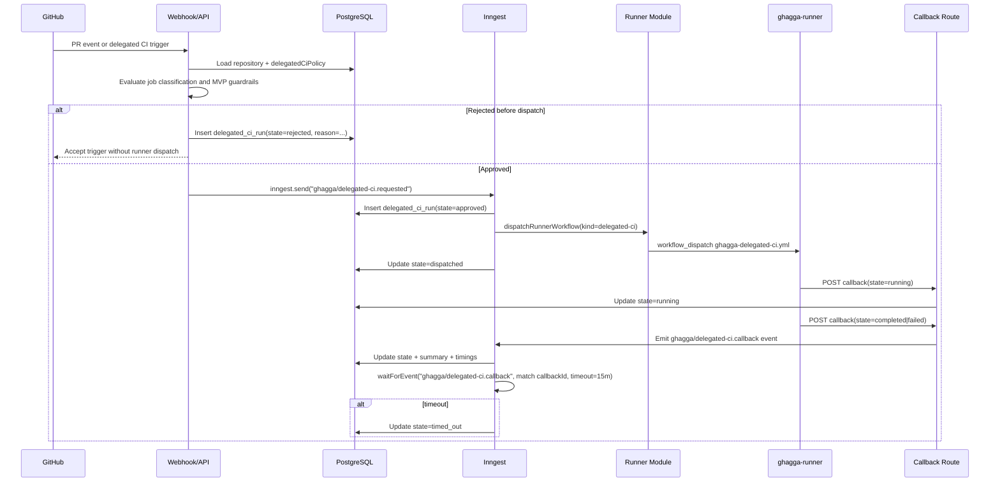

# Design: Delegated CI Capability

## Technical Approach

Delegated CI extends GHAGGA's existing SaaS runner pattern instead of introducing a second execution stack. The server continues to own policy evaluation, token minting, runner discovery, workflow dispatch, callback verification, and durable state. The public `ghagga-runner` repository remains the execution surface, but Delegated CI gets its own workflow template and its own orchestration path.

The key architectural move is to separate three concerns that are currently bundled inside the static-analysis flow:

1. runner infrastructure concerns (`discoverRunnerRepo`, `setRunnerSecret`, callback HMAC, workflow dispatch)
2. execution-kind concerns (static analysis vs delegated CI)
3. repository policy concerns (what is allowed for a specific repo)

For MVP, GHAGGA stays conservative:

- SaaS-only orchestration
- repo-level opt-in only
- no global inheritance for delegated CI enablement
- no production deploys, publishing, signing, or privileged workflows
- no repo-supplied sensitive secrets copied into the runner
- no arbitrary workflow reuse from the private repo
- auditability and explicit rejection reasons over maximum flexibility

This design reuses the current runner repo and callback channel, but introduces a new Delegated CI policy model, a dedicated run ledger, and a dedicated workflow template for CI jobs.

References: `proposal.md`, `specs/delegated-ci/spec.md`, `openspec/specs/runner-architecture/spec.md`, `openspec/specs/runner-callbacks/spec.md`, `openspec/specs/runner-orchestrator/spec.md`.

---

## Architecture Overview

### High-Level Component View

```text
GitHub PR / manual trigger
        |
        v
apps/server/src/routes/webhook.ts or future delegated-ci API route
        |
        v
Delegated CI policy evaluator
  - repo policy lookup
  - job classification
  - MVP safety checks
  - rejection reason mapping
        |
        +----> rejected/non-delegated outcome persisted
        |
        v
Inngest delegated CI function
  - create run record
  - dispatch runner workflow
  - wait for start/final callback
  - timeout handling
        |
        v
apps/server/src/github/runner.ts
  - shared runner repo discovery
  - shared secret provisioning
  - shared workflow dispatch abstraction
        |
        v
{owner}/ghagga-runner (public repo)
  - ghagga-analysis.yml (existing)
  - ghagga-delegated-ci.yml (new)
        |
        v
apps/server/src/routes/runner-callback.ts
  - shared HMAC verification
  - execution-kind aware payload parsing
  - event emission / run update
        |
        v
PostgreSQL + Dashboard/API
  - delegated CI policy
  - delegated CI run states
  - audit trail / rejection reasons
```

### End-to-End Sequence



---

## Architecture Decisions

### ADR-1: Reuse the existing runner infrastructure, but abstract dispatch by execution kind

**Choice**: Keep using `apps/server/src/github/runner.ts`, `apps/server/src/routes/runner-callback.ts`, the per-owner `ghagga-runner` repo, and the Inngest wait-for-callback pattern. Refactor those shared pieces around a generic runner workflow descriptor so static analysis and delegated CI become two execution kinds.

**Alternatives considered**:
- Build a second independent delegated-CI executor path
- Keep extending the static-analysis-specific code paths with more boolean branches

**Rationale**: The current runner pattern already solves the hard parts: runner repo discovery, GitHub token exchange, HMAC callback verification, and async orchestration. Rebuilding that would duplicate risk. At the same time, delegating arbitrary CI is broader than static analysis, so the static-analysis-specific dispatch contract must be separated from shared runner plumbing.

### ADR-2: Use a separate runner workflow template for delegated CI

**Choice**: Create `templates/ghagga-delegated-ci.yml` and keep `templates/ghagga-analysis.yml` focused on static analysis.

**Alternatives considered**:
- Extend `templates/ghagga-analysis.yml` with conditional branches for delegated CI
- Reuse a single mega-template with execution-mode switches

**Rationale**: Static analysis is a tightly controlled GHAGGA-owned workflow with a stable output contract. Delegated CI has different inputs, different result semantics, different risk boundaries, and different failure/rejection states. A separate template gives a smaller audit surface, clearer workflow integrity verification, and a safer MVP rollback path. Duplication is acceptable in MVP because the shared security primitives stay in server-side abstractions.

### ADR-3: Store delegated CI policy as repo-only control-plane data, not inherited global settings

**Choice**: Add a repo-scoped delegated CI policy model on `repositories`, separate from installation-level inherited review settings.

**Alternatives considered**:
- Add delegated CI fields into `RepoSettings` and let them flow through `getEffectiveRepoSettings`
- Add installation-level defaults for delegated CI

**Rationale**: The spec requires repo-by-repo opt-in and conservative defaults. The existing `settings` model is intentionally inheritable through installation settings, which is the wrong behavior for delegated CI. Keeping delegated CI policy repo-only avoids accidental global enablement and preserves explicit ownership review per repository.

### ADR-4: Restrict delegable jobs to GHAGGA-managed execution profiles in MVP

**Choice**: A `safe/delegable` job must map to a GHAGGA-curated execution profile, not an arbitrary repo-authored workflow file or free-form shell command.

**Alternatives considered**:
- Allow repo owners to point to any private workflow/job by name
- Allow arbitrary command strings in repo policy

**Rationale**: Arbitrary repo workflows and scripts are too risky for a public runner MVP. Even without injected secrets, they can leak source via logs or network egress, depend on hidden environment assumptions, or produce unsafe artifacts. Curated execution profiles keep the contract inspectable and enforceable. This trades flexibility for auditability, which matches the MVP goal.

### ADR-5: Persist delegated CI runs in a dedicated table instead of overloading `reviews`

**Choice**: Create a dedicated `delegated_ci_runs` table for state transitions, reason codes, runner correlation IDs, and summarized results.

**Alternatives considered**:
- Reuse the existing `reviews` table with opaque metadata
- Persist only in logs/Inngest history

**Rationale**: Delegated CI is not the same domain as AI review results. It has different state transitions (`rejected`, `approved`, `dispatched`, `running`, `timed_out`), different reporting needs, and should remain queryable even when no review comment exists. A dedicated table improves auditability and keeps review analytics clean.

### ADR-6: Keep GHAGGA internal reporting authoritative for MVP

**Choice**: The authoritative status source is the GHAGGA database plus API/dashboard surfaces. Native repo CI remains authoritative for non-delegable work. GitHub Checks integration is deferred.

**Alternatives considered**:
- Introduce GitHub Checks/Statuses in the MVP
- Rely only on runner workflow logs for status visibility

**Rationale**: GitHub checks would improve UX but expand scope into another integration surface, permissions model, and reconciliation problem. Internal reporting is enough for the MVP, and it is more auditable than ephemeral workflow logs. This also avoids implying GHAGGA has replaced native CI.

---

## Reused Existing Components

| Component | Reuse | Notes |
|------|--------|-------------|
| `apps/server/src/github/runner.ts` | Extend | Keep runner discovery, repo secret provisioning, and workflow dispatch mechanics; extract generic workflow-dispatch helpers. |
| `apps/server/src/routes/runner-callback.ts` | Extend | Keep stateless HMAC verification; broaden payload schema to support delegated CI state/result envelopes. |
| `apps/server/src/inngest/review.ts` pattern | Reuse as reference | Delegated CI should use the same dispatch/wait/resume durable execution pattern, but in a separate Inngest function. |
| `apps/server/src/inngest/client.ts` | Extend | Add delegated CI event schemas. |
| `templates/ghagga-analysis.yml` | Reuse security patterns only | Reuse log suppression, masking, callback signing, cleanup, and log deletion patterns; do not reuse as the execution template itself. |
| `apps/server/src/routes/api/settings.ts` and dashboard settings flows | Extend | Follow current repo-settings API/UI conventions for editing repo-scoped policy. |
| `packages/db/src/schema.ts` / `packages/db/src/queries.ts` | Extend | Follow the current repository/settings JSONB and run-history patterns. |

---

## New Components Required

| Component | Type | Purpose |
|------|--------|-------------|
| `repositories.delegatedCiPolicy` or equivalent repo-only JSONB field | New persistence | Stores repo-scoped opt-in policy and job classification. |
| `delegated_ci_runs` table | New persistence | Stores orchestration states, reasons, timings, callback IDs, and summarized outputs. |
| `apps/server/src/inngest/delegated-ci.ts` | New server module | Owns Delegated CI orchestration separate from AI review flow. |
| `templates/ghagga-delegated-ci.yml` | New runner template | Executes GHAGGA-curated delegated CI job profiles. |
| `apps/server/src/delegated-ci/policy.ts` | New server module | Normalizes policy, applies conservative defaults, validates classification and MVP eligibility. |
| `apps/server/src/delegated-ci/profiles.ts` | New server module | Registry of supported delegated CI execution profiles and their constraints. |
| `apps/server/src/routes/api/delegated-ci.ts` or settings extensions | New/extended API | Exposes policy and run status to the dashboard. |
| Dashboard repo settings section | New UI | Allows repo owners to opt in and classify approved jobs. |

---

## Repo-by-Repo Configuration Model

### Policy Shape

For MVP, delegated CI policy is explicit, repo-only, and non-inherited.

```ts
type DelegatedCiClassification = 'safe/delegable' | 'sensitive/no-delegable';

interface DelegatedCiJobPolicy {
  jobKey: string;
  displayName: string;
  classification: DelegatedCiClassification;
  profile: 'node-lint' | 'node-unit' | 'python-lint' | 'python-pytest' | 'go-test';
  enabled: boolean;
  allowArtifacts: false | string[];
  allowCache: boolean;
  maxDurationMinutes?: number;
  rationale?: string;
}

interface DelegatedCiPolicy {
  enabled: boolean;
  allowManualTrigger?: boolean;
  allowPullRequestTrigger?: boolean;
  jobs: DelegatedCiJobPolicy[];
}
```

### `enabled` precedence rules

Both `DelegatedCiPolicy.enabled` (policy-level) and `DelegatedCiJobPolicy.enabled` (job-level) exist. The precedence is:

- **Policy-level `enabled: false`** overrides everything — no jobs are evaluated, regardless of their individual `enabled` flags.
- **Job-level `enabled: false`** skips that specific job even if the policy is enabled.
- A job with `enabled: true` but policy `enabled: false` is treated as non-delegable (policy wins).

In short: `policy.enabled` is a global kill switch; `job.enabled` is a per-job opt-out within an enabled policy.

### Why this model

- Mirrors the current repo-settings control plane style
- Keeps classification explicit per named job
- Prevents silent installation-wide inheritance
- Makes policy reviewable in the dashboard and in stored audit data
- Allows the execution layer to enforce profile-based constraints before dispatch

### What is intentionally not in MVP

- no installation-level delegated CI defaults
- no arbitrary workflow path references
- no arbitrary shell command fields
- no imported secrets or environment blocks
- no per-job secret maps

---

## Job Classification Model

### Allowed classes

- `safe/delegable`
- `sensitive/no-delegable`

### Classification rule

Only jobs explicitly present in the repo policy and marked `safe/delegable` may proceed to eligibility checks. Everything else is treated as `sensitive/no-delegable`.

### Delegable job checklist

A job may be approved only if all are true:

1. delegated CI is enabled for the repository
2. the job exists in repo policy
3. the job is classified `safe/delegable`
4. the selected profile is supported by GHAGGA in MVP
5. the profile declares no sensitive secret requirements
6. artifacts are disabled or explicitly allowlisted
7. the run stays within the delegated runner time and output contract

### Sensitive / non-delegable examples

- deploy, release, publish, sign, migrate, terraform, kubectl, helm
- jobs requiring cloud credentials, signing keys, or environment secrets
- arbitrary workflow reuse from the private repo
- jobs with ambiguous classification or incomplete profile mapping

---

## Orchestration Flow

### Trigger sources

MVP supports pull-request-related orchestration first. Manual trigger support may be exposed through the dashboard/API, but it uses the same policy and runner path.

### Orchestration steps

1. `routes/webhook.ts` or a delegated-CI API route receives a trigger.
2. Server loads the repository row and repo-only delegated CI policy.
3. Policy evaluator classifies requested jobs and applies MVP guardrails.
4. For each evaluated job, GHAGGA creates a `delegated_ci_runs` row with an initial state:
   - `rejected` for policy failures
   - `approved` for jobs ready to dispatch
5. Inngest function `ghagga/delegated-ci.requested` dispatches approved jobs one by one.
6. `runner.ts` provisions ephemeral secrets/tokens and dispatches `ghagga-delegated-ci.yml`.
7. Runner workflow sends an optional `running` callback after checkout/preflight succeeds.
8. Runner workflow sends a final callback with `completed` or `failed` plus a summarized result envelope.
9. Callback route verifies HMAC, determines `executionKind`, and emits the appropriate Inngest event (`ghagga/runner.callback` for static-analysis, `ghagga/delegated-ci.callback` for delegated-ci) so the correct durable function resumes via `waitForEvent`.
10. If no final callback arrives before timeout, Inngest marks the run `timed_out`.

### Concurrency model for multiple delegated jobs

When a repository has multiple approved delegated jobs (e.g., `lint`, `unit-tests`, `type-check`), MVP dispatches them concurrently:

- Each approved job gets its own Inngest function invocation and its own `delegated_ci_runs` row.
- Each job is independent — failure of one does not cancel others.
- A concurrency limit per repository can be added post-MVP if dispatch volume becomes a concern.

### Callback/result envelope

```ts
type DelegatedCiRunState =
  | 'approved'
  | 'rejected'
  | 'dispatched'
  | 'running'
  | 'completed'
  | 'failed'
  | 'timed_out';

interface DelegatedCiCallbackPayload {
  executionKind: 'delegated-ci';
  callbackId: string;
  repoFullName: string;
  jobKey: string;
  state: 'running' | 'completed' | 'failed';
  startedAt?: string;
  completedAt?: string;
  durationMs?: number;
  summary?: string;
  outcome?: 'success' | 'failure';
  artifacts?: Array<{ name: string; kind: 'junit' | 'coverage-summary' | 'text-summary' }>;
  errorCode?: string;
  errorMessage?: string;
}
```

The static-analysis payload path remains intact. The callback router becomes execution-kind aware rather than review-only.

**Callback event routing by execution kind:**

The callback route determines `executionKind` from the incoming payload and emits the appropriate Inngest event so the correct durable function resumes:

- For `executionKind: 'static-analysis'`: emits the existing `ghagga/runner.callback` event (unchanged from current behavior)
- For `executionKind: 'delegated-ci'`: emits a new `ghagga/delegated-ci.callback` event

The delegated CI Inngest function uses `step.waitForEvent("ghagga/delegated-ci.callback", { match: "data.callbackId" })` to resume on its specific event, ensuring static-analysis callbacks never accidentally wake a delegated CI function and vice versa.

---

## Reporting and State Model

### Durable state tracking

Use a dedicated run ledger so GHAGGA can answer:

- which repo and job were evaluated
- whether the job was rejected vs actually dispatched
- current and final state
- why the run was rejected, failed, or timed out
- which callback/workflow correlation ID produced the outcome

### Proposed persistence shape

```ts
interface DelegatedCiRunRow {
  id: number;
  repositoryId: number;
  prNumber?: number;
  jobKey: string;
  classification: DelegatedCiClassification;
  state: DelegatedCiRunState;
  reasonCode?: string;
  reasonDetail?: string;
  callbackId?: string;
  workflowRunId?: string;
  profile: string;
  summary?: string;
  resultSummary?: unknown;
  startedAt?: Date;
  completedAt?: Date;
  createdAt: Date;
  updatedAt: Date;
}
```

### Dashboard/API behavior

- repo settings page shows delegated CI policy and recent runs
- recent-run list distinguishes `rejected` from `failed`
- rejection reason codes are shown directly to repo owners
- run detail page or drawer can show high-level summaries and safe artifacts only

### GitHub-side reporting

For MVP, GHAGGA does not attempt full GitHub Checks integration. Native CI remains the authoritative GitHub status mechanism for non-delegable work. Delegated CI reporting is primarily in GHAGGA surfaces, with GitHub status integration deferred until policy, callbacks, and audit trails are stable.

---

## Security Guardrails

### Logs

- Reuse current silent-execution pattern from `templates/ghagga-analysis.yml`
- Workflow logs MUST contain step names and generic status only
- Tool/test stdout and stderr MUST redirect to files or `/dev/null`
- Repo names, tokens, callback secrets, and local paths MUST be masked with `::add-mask::`
- Workflow logs MUST be deleted after callback completion, same as current runner pattern

### Artifacts

- Default is no artifact upload
- Policy may explicitly allow only summary-style artifacts (`junit`, `coverage-summary`, small text/json summaries)
- Source bundles, raw workspace zips, dependency caches, and arbitrary files are disallowed
- If the workflow attempts to produce a non-allowlisted artifact, the run is marked failed

### Cache

- Cache keys must include runner template version + installation/repo/job identity
- No cross-repo restore keys
- Cache is opt-in per job policy
- Cache contents must be dependency/tool caches only, never workspace exports or result bundles

### Tokens

- Reuse installation token exchange from current runner flow
- Tokens remain minimal, time-bounded, and tied to the target repository
- Runner gets only what it needs for checkout and runner-repo operations
- No long-lived PAT fan-out

### Secrets

- MVP forbids repo/environment secrets for delegated jobs
- `safe/delegable` jobs must run with GHAGGA-provided ephemeral control secrets only (`GHAGGA_TOKEN`, callback secret)
- No secret values are accepted through delegated CI policy
- If a job needs secrets, it is `sensitive/no-delegable`

### Workflow integrity

- The server continues to own canonical template content and integrity verification
- Delegated CI template hash verification is independent from static-analysis template verification
- A tampered delegated CI workflow blocks dispatch for delegated CI only; static analysis remains unaffected

---

## Fallback and Rejection Strategy

### Pre-dispatch rejection

Reject without dispatch when:

- delegated CI is disabled for the repo
- job is missing from policy
- classification is `sensitive/no-delegable`
- profile is unsupported in MVP
- secrets/artifacts/cache requirements violate policy
- runner template integrity fails and cannot be repaired

Store machine-readable reason codes such as:

- `delegated_ci_disabled`
- `job_not_configured`
- `job_sensitive`
- `profile_unsupported`
- `secrets_required`
- `artifact_policy_violation`
- `workflow_integrity_failed`

### Post-approval fallback

If dispatch cannot proceed or the runner fails after approval:

- mark the run `failed` or `timed_out`
- retain the original approval/rejection audit data
- do not silently retry with a broader or less safe execution mode
- do not attempt to proxy native CI from GHAGGA

### Native CI relationship

GHAGGA never converts a rejected job into an unsafe delegated run. The repository's own native CI remains the authoritative path for anything outside the delegated contract.

---

## Operational Considerations and Rollout

### MVP rollout

1. Ship server-side policy model and run ledger behind `GHAGGA_DELEGATED_CI_MVP`
2. Enable only for selected internal/beta repos
3. Start with a very small set of curated profiles
4. Keep static analysis workflow untouched during rollout
5. Expand profile coverage only after callback/state model proves stable

### Observability

- log `delegatedCiRunId`, `repoFullName`, `jobKey`, `callbackId`, `state`
- count rejections separately from execution failures
- track timeout rate and dispatch failure rate
- add a sweeper job for stale `dispatched` / `running` rows older than timeout budget

### Support and troubleshooting

- runner status endpoint can later expose whether the delegated CI template is present and healthy
- dashboard should surface latest rejection/failure reason directly
- template version should be visible for audit and rollback

### Rollback

- disable feature flag and stop creating new delegated CI runs
- keep existing static-analysis runner flow unchanged
- preserve historical run records for audit
- revert only the delegated CI template without affecting `ghagga-analysis.yml`

---

## File Changes

| File | Action | Description |
|------|--------|-------------|
| `packages/db/src/schema.ts` | Modify | Add repo-only delegated CI policy storage and a `delegated_ci_runs` table. |
| `packages/db/src/queries.ts` | Modify | Add CRUD/query helpers for delegated CI policy and run states. |
| `packages/types/src/delegated-ci.ts` | Create | Add shared delegated CI policy/state/result types (`DelegatedCiJobPolicy`, `DelegatedCiClassification`, `DelegatedCiRunState`, etc.). Re-export from `packages/types/src/index.ts`. |
| `packages/types/src/api.ts` | Modify | Expose delegated CI policy/run API contracts to the dashboard. |
| `apps/server/src/github/runner.ts` | Modify | Extract generic runner dispatch helpers and add delegated CI workflow dispatch support. |
| `apps/server/src/routes/runner-callback.ts` | Modify | Accept execution-kind aware callback payloads and update delegated CI runs. |
| `apps/server/src/inngest/client.ts` | Modify | Add delegated CI event schemas. |
| `apps/server/src/inngest/delegated-ci.ts` | Create | New durable orchestration flow for delegated CI. |
| `apps/server/src/routes/api/settings.ts` | Modify | Read/write repo-only delegated CI policy in repo settings APIs. |
| `apps/server/src/routes/api/delegated-ci.ts` | Create or extend | Query delegated CI run history/status for the dashboard. |
| `apps/dashboard/src/pages/Settings.tsx` | Modify | Add delegated CI policy controls to the repo settings UI. |
| `apps/dashboard/src/lib/api.ts` | Modify | Add hooks for delegated CI policy and run history. |
| `apps/dashboard/src/lib/types.ts` | Modify | Re-export new delegated CI API types. |
| `templates/ghagga-delegated-ci.yml` | Create | Dedicated workflow template for delegated CI jobs. |
| `docs/runner-architecture.md` | Modify | Document the new execution kind and template split. |
| `docs/security.md` | Modify | Document delegated CI safety boundaries and non-goals. |

---

## Interfaces / Contracts

### Runner workflow descriptor

The current `dispatchWorkflow()` in `runner.ts` takes static-analysis-specific inputs (file patterns, model, review ID, etc.) and is tightly coupled to the analysis execution kind. The refactor separates runner infrastructure from execution-kind concerns by introducing a kind-agnostic descriptor:

```ts
interface RunnerWorkflowDescriptor {
  kind: 'static-analysis' | 'delegated-ci';
  workflowFile: 'ghagga-analysis.yml' | 'ghagga-delegated-ci.yml';
  callbackRoute: '/runner/callback';
  templateVersion: string;
  inputs: Record<string, string>;
}
```

The descriptor carries only structural and routing information — it does not encode any execution-kind-specific semantics. The `inputs` field is a generic `Record<string, string>` that each execution kind populates via its own factory function.

**Factory functions:**

- `buildAnalysisDescriptor(...)` — creates a descriptor for static analysis, mapping file patterns, model, review ID, etc. into `inputs`
- `buildDelegatedCiDescriptor(...)` — creates a descriptor for delegated CI, mapping job key, profile, and CI-specific config into `inputs`
- A general `buildDescriptor(kind, params)` pattern ensures each execution kind owns its own input serialization

**Refactored dispatch:**

The existing `dispatchWorkflow()` becomes `dispatchRunnerWorkflow(descriptor: RunnerWorkflowDescriptor)`, which handles only the shared runner infrastructure concerns: runner repo discovery (`discoverRunnerRepo`), secret provisioning (`setRunnerSecret`), and the GitHub Actions `workflow_dispatch` API call. It no longer knows what execution kind it is dispatching.

### Template Input Packing

GitHub Actions `workflow_dispatch` supports a maximum of ~10 inputs. The delegated CI dispatch needs to pass: `callbackUrl`, `callbackSecret`, `token`, `repoFullName`, `headSha`, `baseBranch`, `jobKey`, `profile`, `allowArtifacts`, `allowCache`, `maxDurationMinutes`, `prNumber` — 12 values, exceeding the limit.

To stay within the constraint, delegated CI packs non-security inputs into a single JSON-encoded `config` input:

```json
{
  "jobKey": "unit-tests",
  "profile": "node-unit",
  "allowArtifacts": false,
  "allowCache": true,
  "maxDurationMinutes": 10,
  "prNumber": 42
}
```

Security-critical inputs that the runner needs before parsing JSON remain as separate `workflow_dispatch` inputs:

| Input | Separate | Reason |
|-------|----------|--------|
| `callbackUrl` | Yes | Runner must know where to POST before executing any job logic |
| `callbackSecret` | Yes | Required for HMAC signing before any JSON parsing |
| `token` | Yes | Required for checkout before any JSON parsing |
| `repoFullName` | Yes | Required for checkout |
| `headSha` | Yes | Required for checkout |
| `baseBranch` | Yes | Required for diff/merge-base context |
| `config` | Yes (JSON) | Packs all remaining inputs |

This yields 7 total `workflow_dispatch` inputs, well within the ~10 limit. The `ghagga-delegated-ci.yml` template parses the `config` input using `fromJSON()` in its steps.

### Delegated CI dispatch request

```ts
interface DelegatedCiDispatchRequest {
  ownerLogin: string;
  repoFullName: string;
  prNumber?: number;
  headSha: string;
  baseBranch: string;
  jobKey: string;
  profile: string;
  callbackUrl: string;
  allowArtifacts: string[];
  allowCache: boolean;
  maxDurationMinutes: number;
  token: string;
}
```

### API-facing repo policy contract

```ts
interface RepositoryDelegatedCiSettings {
  enabled: boolean;
  jobs: Array<{
    jobKey: string;
    displayName: string;
    classification: DelegatedCiClassification;
    profile: string;
    enabled: boolean;
    allowArtifacts: false | string[];
    allowCache: boolean;
    maxDurationMinutes?: number;
    rationale?: string;
  }>;
}
```

---

## Testing Strategy

| Layer | What to Test | Approach |
|-------|-------------|----------|
| Unit | Policy evaluator defaults, classification, rejection reasons | Pure-function tests in server policy module |
| Unit | Runner dispatch descriptor building for delegated CI | Mock `fetch` and secret provisioning in `runner.ts` tests |
| Unit | Callback payload verification and state transitions | Extend `runner-callback.test.ts` |
| Integration | Repo settings API reads/writes delegated CI policy correctly | Hono route tests matching current settings-route style |
| Integration | Inngest delegated CI flow updates states from approved to completed/failed/timed_out | Inngest function tests with mocked callbacks |
| Integration | DB queries for delegated CI runs and filters | Query tests in `packages/db` |
| E2E | Beta repo opt-in, approved job dispatch, rejection path, timeout path | End-to-end SaaS flow with runner template fixture and mocked GitHub API |

---

## Migration / Rollout

No data migration is required for existing reviews or runner behavior. This change adds new repo policy data and new run-history data only.

Rollout is feature-flagged and additive:

- existing runner setup stays valid
- existing static-analysis flow stays valid
- repos without delegated CI policy continue unchanged
- rollback is disabling the feature flag and removing the delegated CI template path from dispatch

---

## Risks and Trade-offs

- **Arbitrary repo code still carries exfiltration risk**: even curated profiles may execute project code or scripts; MVP reduces risk by forbidding arbitrary workflows and secrets, but cannot make all tests perfectly safe on public runners.
- **Separate template increases maintenance overhead**: two templates mean some duplicated runner steps, but the safety and audit benefits outweigh template DRYness in MVP.
- **Repo-only policy adds schema/API surface**: this is more work than reusing inherited settings, but it prevents accidental org-wide enablement.
- **Internal-only reporting is weaker GitHub UX**: dashboard-first reporting is less seamless than Checks, but it keeps the MVP smaller and easier to reason about.
- **Profile-based delegation limits flexibility**: users will not be able to delegate every existing CI job unchanged, which is intentional for the first version.

---

## Open Questions

- [ ] Which curated execution profiles are in scope for the first beta (`node-lint`, `node-unit`, `python-pytest`, etc.)?
- [ ] Do we want a lightweight PR comment summary for delegated CI beta runs, or should all reporting stay dashboard-only in MVP?
